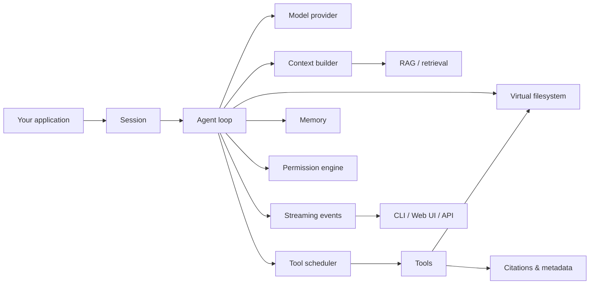

# linch

> An embeddable agent harness for context-heavy Python applications.

**linch** is an async-first, event-driven Python SDK for building agent loops inside your own application.

It gives you the runtime pieces that production agents usually need but simple tool-calling wrappers leave to you: streamed events, tool scheduling, context/RAG, tiered memory, virtual filesystem offloading, structured outputs, permissions, retries, provider adapters, cost tracking, evals, MCP, skills, and subagents.

Use linch when you want to build your own domain workflow — not force it into a hosted assistant, a rigid graph DSL, or a black-box multi-agent abstraction.

---

## Why linch?

Most agent frameworks start from one of three ideas:

- **agents as chat loops** — simple, but hard to control once tools, context, memory, and side effects grow;
- **agents as graphs** — explicit and durable, but sometimes too heavy for application-level workflows;
- **agents as teams** — useful for collaboration patterns, but not always the right abstraction for context-heavy product features.

linch starts from a different idea:

> An agent is a runtime you embed, observe, constrain, and feed with the right context.

That means linch focuses on the boring-but-critical layer between your app and the model:

1. **Context control** — build RAG/context per turn before the model sees it.
2. **Tool control** — schedule tools with resource awareness, timeout, retry, and permission checks.
3. **State control** — keep sessions, memory, files, citations, and large outputs manageable.
4. **Provider control** — run against different model providers without rewriting your workflow.

---

## What you can build

linch is designed for application developers building agentic features such as:

- document and report assistants;
- RAG systems over large internal knowledge bases;
- coding and software-engineering agents;
- extraction and synthesis workflows;
- long-running research assistants;
- local/offline agent demos;
- tools that need citations, permissions, filesystem state, or large-result offloading.

---

## Core features

| Area | What linch provides |
|---|---|
| Agent loop | `Agent`, `Session`, async event streaming, loop guards |
| Tools | Duck-typed tools, runtime registries, parallel scheduling, resource locks, local or Docker-backed Bash execution |
| Reliability | Per-tool timeout, opt-in retry, structured tool errors, recovery hints |
| Context | `ContextBuilder`, RAG context injection, context budgets, compaction ladder (micro-compact, reactive recovery, circuit breaker) |
| Memory | Search/upsert tools, flat and tiered memory stores, persistent memory examples |
| Filesystem | Virtual filesystem, automatic large-result offloading, disk/state/sqlite backends |
| Safety | Permission engine, tool/path/bash rules, dangerous-action skipping |
| Budgets | `RunBudget` token/USD caps shared across the subagent tree, warning + exceeded events, graceful stop |
| Workflows | Deterministic fleet loops: `wf.agent`/`parallel`/`pipeline`/`phase`, journaled resume, shared budgets |
| Providers | OpenAI Responses, OpenAI Chat Completions, Anthropic, Gemini, llama.cpp, OpenAI-compatible endpoints, pluggable providers |
| Extensibility | Python hooks, MCP, skills, subagents (fork/continue, background workers, coordinator mode), observer compatibility |
| Outputs | Structured output schemas, citations, usage/cost events, metadata-rich tool results, run reports |

---

## Architecture



linch keeps the loop small, but makes the surrounding runtime explicit: context, tools, permissions, state, files, memory, and events are all first-class parts of the system.

---

## Install

From [PyPI](https://pypi.org/project/linch/):

```sh
pip install linch
```

With optional extras (Anthropic, MCP, Gemini, OpenTelemetry, Postgres):

```sh
pip install 'linch[anthropic,mcp,gemini]'
```

For local development:

```sh
pip install -e '.[dev,mcp,anthropic,gemini]'
```

---

## Quickstart

New to Linch? The step-by-step guide is in
[`docs/usage/quickstart.md`](docs/usage/quickstart.md), including an offline
smoke test that runs without an API key.

```python
import asyncio
import os

from linch import Agent
from linch.sessions import InMemorySessionStore

agent = Agent(
    model="gpt-5",
    openai_api_key=os.environ.get("OPENAI_API_KEY"),
    session_store=InMemorySessionStore(),
    permissions={"mode": "skip-dangerous"},
)

async def main():
    session = await agent.session()

    async for event in session.run("Summarize what this project does in one paragraph."):
        if event.type == "result":
            print(event.final_text)

asyncio.run(main())
```

Put `OPENAI_API_KEY=...` in `.env` or export it in your shell. Never commit `.env`.

---

## Safe local demos

These examples exercise useful local code paths without requiring a live provider call.

```sh
python3 examples/tools/parallel_search_agent.py
python3 examples/tools/runtime_tools.py
python3 examples/context/rag_context_builder.py
python3 examples/memory/memory_agent.py
python3 examples/tools/tool_reliability_agent.py
python3 examples/memory/sqlite_memory_agent.py

# Filesystem offload — fully offline, no API key needed
python3 examples/tools/filesystem_offload.py
```

---

## Core concepts

### Agent and Session

An `Agent` owns shared configuration: model, provider, tools, permissions, hooks, memory, and session store.

A `Session` represents one conversation or workflow run. One agent can serve many sessions.

### Deep agent preset

`create_deep_agent()` returns an `Agent` with long-horizon orchestration defaults: durable run/session SQLite storage, task planning tools, specialist subagents (researcher, planner, implementer), a persistent `/memories` virtual filesystem partition, and deepened system prompt with planning/verification doctrine.

`coordinator=True` turns the parent into a pure orchestrator — it loses heavy tools (Edit/Write/Bash) and gains `SubagentContinueTool` and `TaskStopTool`. Workers receive full tool access. Background workers (`run_in_background=True` on Subagent) deliver results via `<task-notification>` at the top of the next turn. Fork/continue lets you re-engage any retained worker with its full prior context via `SubagentContinue`.

### Events

linch streams the loop as events instead of hiding execution behind a blocking function call. This makes it easier to build CLIs, web UIs, background workers, and observability integrations.

### Hooks

Hooks are the canonical extension mechanism for the agent loop. Register Python hook objects with `Agent(hooks=[...])` to inspect or control the run at typed chokepoints: agent start/stop, prompt submit, turn start/stop, provider calls, pre/post tool use, final answer, stop, subagent start/stop, and event emission.

Built-in adapters are available when you want a standard extension as a hook:
`ContextInjectionHook`, `ToolMiddlewareHook`, `RunTelemetryHook`,
`FinalAnswerVerifierHook`, and `StopPredicateHook`.

```python
from linch import Agent, HookResult

class GuardTools:
    def on_pre_tool_use(self, ctx):
        if ctx.tool_name == "Bash" and "rm -rf" in str(ctx.input.get("command", "")):
            return HookResult.block("blocked dangerous command")
        return None

agent = Agent(
    model="gpt-5",
    hooks=[GuardTools()],
    permissions={"mode": "skip-dangerous"},
)
```

### Tools and scheduler

Tools are duck-typed Python objects. They can declare schemas, scopes, resources, timeouts, summaries, and execution behavior. The scheduler runs compatible tool calls in parallel while respecting resource constraints and permission rules.

For simple tools, use `@tool`; it creates the same Tool-compatible object that
the registry and scheduler already understand:

```python
from linch import Agent, ToolContext, tool
from linch.sessions import InMemorySessionStore
from linch.tools.registry import empty_tools

@tool(description="Look up an internal document.")
async def search_docs(query: str, ctx: ToolContext) -> str:
    return await ctx.deps.search(query)

agent = Agent(
    model="gpt-5",
    tools=empty_tools(search_docs),
    deps=my_vector_store,
    session_store=InMemorySessionStore(),
)
```

### ContextBuilder

`ContextBuilder` lets you construct turn-specific context before the model runs. It is implemented as a built-in hook adapter; for new cross-cutting extension work, prefer `Agent(hooks=[...])`.

### Memory

linch includes memory primitives and tools for searching and upserting reusable facts. Memory can be in-memory, sqlite-backed, tiered by working/episodic/semantic buckets, or replaced with your own store.

### Virtual filesystem

Large tool results should not always stay in the model context. linch can offload large outputs to a virtual filesystem and pass references back into the loop.

### Permissions

The permission engine controls dangerous actions at the runtime layer. You can define tool, path, and bash rules instead of relying only on prompts.

### Providers

linch separates the agent runtime from the model provider. Built-in providers include OpenAI Responses, OpenAI Chat Completions, Anthropic, Gemini, and llama.cpp. Use OpenAI Chat Completions with `base_url` for OpenAI-compatible endpoints like DeepSeek, and inspect known direct-provider models with `list_provider_models()`.

---

## When to use linch

linch is a good fit when you need:

- an agent loop embedded inside your own Python application;
- streaming events for UI, API, or worker integration;
- explicit control over tools, permissions, retries, and timeouts;
- RAG/context construction as a first-class runtime step;
- memory and filesystem state across longer workflows;
- provider flexibility without rewriting application logic;
- a small runtime layer you can build domain-specific workflows on top of.

## When not to use linch

linch may be more than you need if:

- your feature is a single stateless LLM call;
- you want a no-code agent builder;
- you want a fully hosted assistant platform;
- you want every workflow expressed as a static graph from day one;
- you only need a thin wrapper around one provider's API.

---

## Examples

Examples are organized by subsystem under `examples/`.

**`examples/core/`** — agent fundamentals and real-world patterns

| File | What it shows |
|---|---|
| `core/tiny_agent.py` | Smallest possible agent |
| `core/coding_agent.py` | SWE agent — full tool set, BashRule/PathRule safety fence, LoopGuard, multi-turn |
| `core/policy_aware_execution.py` | Docker-backed Bash execution — permission rules plus opt-in runtime restrictions |
| `core/reading_agent.py` | Read-only codebase Q&A — no write/edit/bash, custom reviewer persona |
| `core/chat_agent.py` | Pure conversation agent — no tools, custom domain, structured output, ContextBuilder injection |
| `core/custom_permissions.py` | All permission modes and rule types |
| `core/system_prompts.py` | append, replace, per-session override, persona patterns |
| `core/structured_output.py` | OutputSchema, final_tool_name, JSON extraction |
| `core/event_streaming.py` | Consuming events for SSE, WebSocket, CLI progress |
| `core/multi_session.py` | One Agent, many users, shared deps |
| `core/deep_agent_resume.py` | `create_deep_agent()` — 4 demos: planning + /memories + run resume; background worker + notification; fork/continue retained worker; coordinator orchestration |
| `core/loop_guard_agent.py` | LoopGuard — identical-call and failure-streak detection |
| `core/budget_capped_agent.py` | `RunBudget` — token cap, 90% warning event, graceful exceeded stop |
| `core/compaction_ladder_agent.py` | `CompactionLadder` — micro-compact rung, reactive recovery, circuit breaker |
| `core/workflow_fleet.py` | `agent.run_workflow()` — parallel fan-out, pipeline, shared budget, crash + journal resume |
| `core/interactive_cli.py` | Interactive REPL |

**`examples/tools/`** — tool patterns and scheduler

| File | What it shows |
|---|---|
| `tools/custom_tools.py` | 5 tool patterns: read, write, exec, parallel, with deps |
| `tools/parallel_search_agent.py` | Scheduler V2: parallel search, resources, concurrency cap |
| `tools/runtime_tools.py` | Runtime registry add/remove/replace/select and schema export |
| `tools/tool_reliability_agent.py` | Timeout, per-tool opt-out, `RetryOptions` |
| `tools/filesystem_offload.py` | Virtual filesystem backends, auto-offload of large results (*offline*) |

**`examples/context/`** — RAG and context hooks

| File | What it shows |
|---|---|
| `context/context_injection.py` | ContextInjectionHook patterns: RAG per-turn, budget, selected tools |
| `context/rag_context_builder.py` | ContextInjectionHook RAG with metadata and budget reporting |

**`examples/memory/`** — memory primitives

| File | What it shows |
|---|---|
| `memory/memory_agent.py` | Core memory primitives with search/upsert tools and citations |
| `memory/sqlite_memory_agent.py` | SqliteMemoryStore — persistent memory, round-trip, upsert update |
| `memory/pgvector_memory.py` | Postgres memory example with optional vector-style retrieval |

**`examples/observability/`** — telemetry hooks and tracing

| File | What it shows |
|---|---|
| `observability/observability_agent.py` | RunTelemetryHook with LoggingObserver + optional OpenTelemetryObserver |
| `observability/custom_observer.py` | Custom observer: latency tracking, error counts per tool |

**`examples/providers/`** — provider-specific features

| File | What it shows |
|---|---|
| `providers/openai_agent.py` | OpenAI Chat Completions — basic, thinking, tool use, structured output, multi-turn |
| `providers/anthropic_agent.py` | Anthropic — extended thinking, prompt caching, tool-backed structured output |
| `providers/deepseek_agent.py` | DeepSeek via OpenAI-compatible and Anthropic-compatible endpoints |

**`examples/integrations/`** — subagents, skills, MCP

| File | What it shows |
|---|---|
| `integrations/subagent_coordinator.py` | Agent definition files, tool-filtered subagents, SubagentEvent |
| `integrations/multi_agent_isolation.py` | Context isolation, sequential pipeline, parallel analysts, subagent + filesystem offload (*offline*) |

---

## Public API

- `linch`: `Agent`, `Session`, `create_deep_agent`, `create_subagent_definition`, `generate_subagent_definition`, events (including `BackgroundWorkerEvent`), types, errors, `DetailedCompaction`, `RetryOptions`, `ToolTimeoutError`, `tool`, `FunctionTool`, `empty_tools`, `tools_from_defaults`, run reports, provider catalog helpers
- `linch.config`: `FeatureFlags`, `SystemPromptConfig`, `SystemPromptSection`
- `linch.context`: `ContextBuilder`, `ContextBuildResult`, `ContextBudget`
- `linch.deep_agent`: `create_deep_agent`, `DEEP_AGENT_SYSTEM_PROMPT`, `COORDINATOR_SYSTEM_PROMPT`, `DEEP_AGENT_SUBAGENTS`
- `linch.skills`: built-in and project `SKILL.md` workflows, including `verify`
- `linch.memory`: `MemoryStore`, `MemoryItem`, `MemoryContextBuilder`, `MemorySearchTool`, `MemoryUpsertTool`, `TieredMemoryStore`, reference stores
- `linch.evals`: `ScriptedProvider`, `EvalCase`, `run_eval`, built-in scorers for text, tools, schema, cost, context, memory, and recovery
- `linch.pricing`: `ModelPricing`, `cost_usd`
- `linch.types`: `OutputSchema`, `ToolChoice`, `Message`, `ProviderRequest`
- `linch.providers`: `OpenAIResponsesProvider`, `OpenAIChatCompletionsProvider`, `AnthropicProvider`, `GeminiProvider`, `LlamaCppProvider`, `ProviderModelInfo`, `list_provider_models`, `get_provider_model_info`
- `linch.tools`: `@tool`, `FunctionTool`, duck-typed tool protocol, `ResourceAccess`, `Citation`, `ToolResult`, `ToolRegistry`, built-in tools, `SubagentContinueTool`, `TaskStopTool`
- `linch.subagents`: `WorkerHandle`, `RunSubagentArgs`, `ContinueSubagentArgs`, `RunSubagentResult`, disk-backed subagent generation helpers
- `linch.sessions`: `InMemorySessionStore`, `SqliteSessionStore`
- `linch.filesystem`: `FileBackend`, `StateFileBackend`, `DiskFileBackend`, `SqliteFileBackend`, `CompositeFileBackend`, `OffloadConfig`, `filesystem_tools`
- `linch.permissions`: `PermissionEngine`, `ToolRule`, `PathRule`, `BashRule`

---

## Documentation

| File | What it covers |
|---|---|
| [`docs/usage/`](docs/usage/README.md) | Getting started, install, config, providers, tools, hooks, structured output, RAG, workflows, deep agent |
| [`docs/architecture.md`](docs/architecture.md) | Internal data flow, module contracts, design invariants |
| [`docs/contributing.md`](docs/contributing.md) | Dev setup, code rules, test conventions, PR checklist |
| [`examples/`](examples/) | Runnable examples by subsystem |

---

## Development

```sh
pytest
ruff check . && ruff format --check .
pyright
```

See [`docs/contributing.md`](docs/contributing.md) for the full contributor guide.

---

## Name

**linch** blends two ideas:

| | |
|---|---|
| **靈** `linh` | In classical Sino-Vietnamese, 靈 carries the meaning of *spirit*, *effortless intelligence*, and *vital agility* — an unseen force that makes a mechanism feel alive. |
| **cinch** | A saddle harness piece; English slang for *easy, simple, sure*. |

A *linch* is small — a single pin — but it holds the wheel on the axle. That is the SDK's ambition: the smallest harness that makes complex agent orchestration feel like a cinch.

> 靈活簡便，以一馭萬。  
> *Linh hoạt giản tiện, dĩ nhất ngự vạn.*  
> *"Agile and simple — govern ten thousand things with one."*
