# Linch Architecture

Professional reference for the V2 harness. Covers every subsystem, its contract, the complete data flow, and the invariants that must not break.

---

## 1. System Overview

The framework is a harness of pluggable subsystems composed around a single event-driven loop. The caller only interacts with `Agent` (config) and `Session` (state); everything else is internal machinery wired together inside `run_loop`.

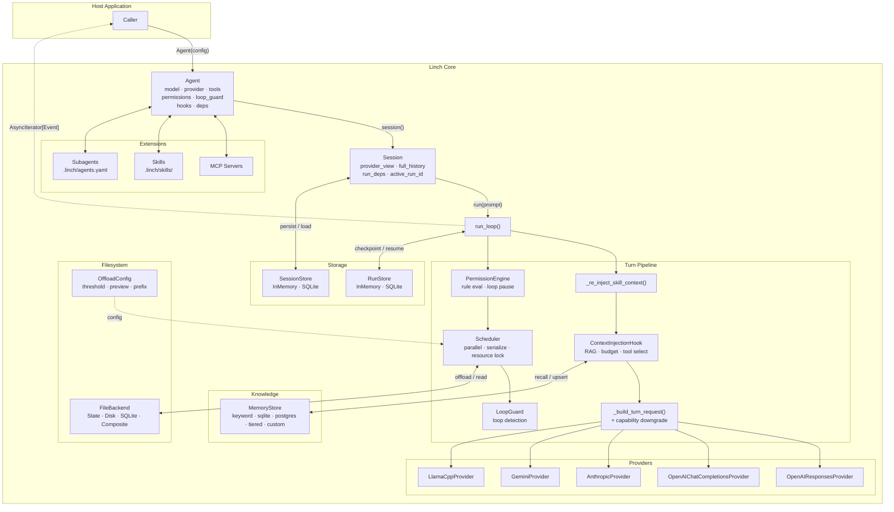

---

## 2. Turn Lifecycle

One complete agent turn — from receiving the prompt to deciding whether to continue looping.

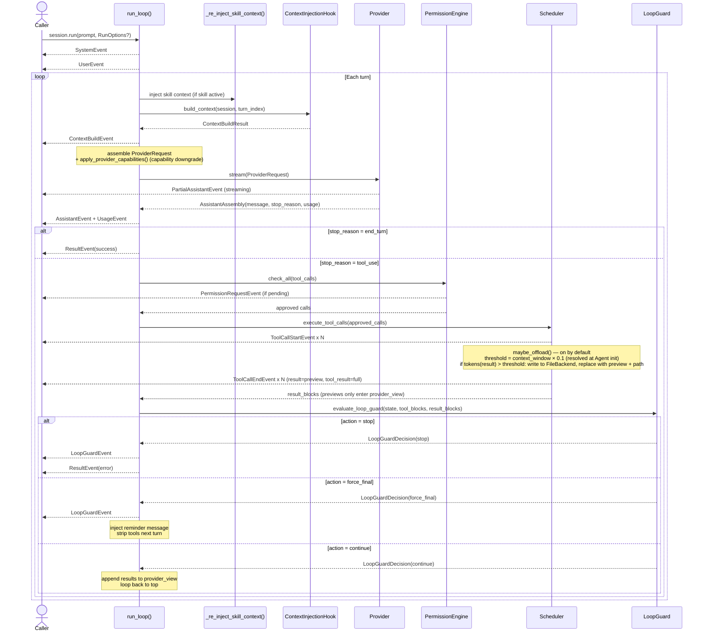

---

## 3. Subsystems

### 3.1 Scheduler — Parallel & Serialized Execution

The scheduler is the only place tool calls are executed. It enforces concurrency policies and resource conflict rules before dispatching.

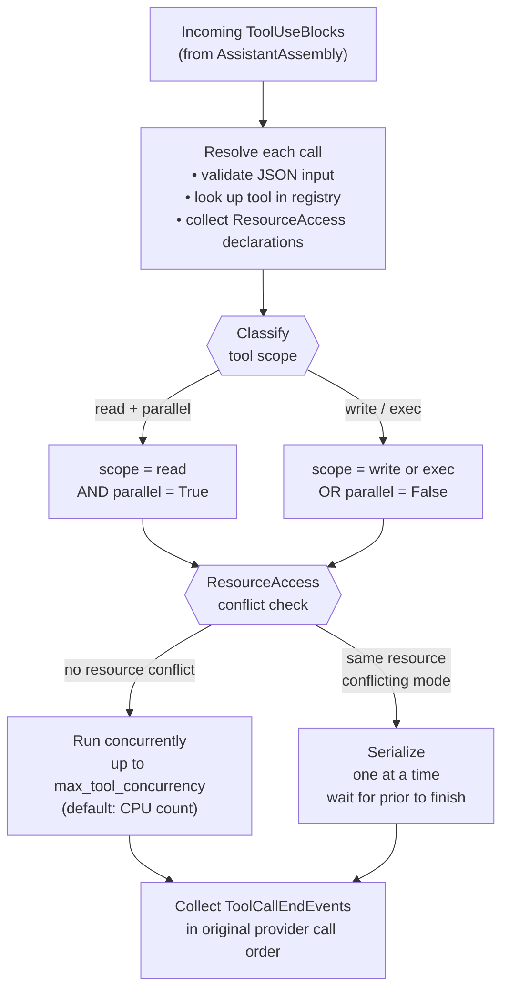

**Rules:**
- `scope="read"` + `parallel=True` → may run concurrently up to `Agent(max_tool_concurrency=N)` or env `AGENTKIT_MAX_TOOL_CONCURRENCY`.
- `scope="write"` or `scope="exec"` → always serialize, regardless of `parallel` flag.
- `ResourceAccess(resource, mode)` enables finer conflict detection: two `"read"` accesses on the same resource overlap freely; any `"write"` on a resource being read or written by another call serializes.
- Result events are emitted in the **original provider tool-call order**, not completion order.
- **Timeouts** — `Agent(tool_timeout_ms=N)` (env `AGENTKIT_TOOL_TIMEOUT_MS`) sets an agent-wide execution deadline. Per-tool override: `execution_timeout_ms` class attribute (`0` = opt-out). Timeout → `is_error=True` result, run continues. Uses `asyncio.wait_for` (Python 3.10 safe). `ToolTimeoutError` (`retryable=True`) is the typed exception class.
- **Retry** — `Agent(tool_retry=RetryOptions(...))` enables opt-in exponential-backoff retry. Read-scope tools retry any exception; write/exec tools only retry when the tool sets `retryable = True`. `AbortError` is never retried.

---

### 3.2 Loop Guard — Agentic Loop Detection

Detects obvious runaway loops cheaply (no extra LLM call) and terminates cleanly.

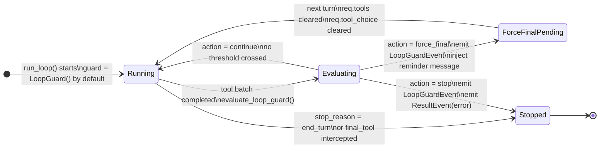

**Trip conditions** — `evaluate_loop_guard` checks after every tool batch:

| Check | Threshold | Config field |
|---|---|---|
| Repeated identical call | `call_counts[name:sorted_json] >= N` | `max_identical_tool_calls` (default `3`) |
| Consecutive failure streak | all tools errored for N batches in a row | `max_consecutive_failures` (default `3`) |
| Max turns | `range(max_turns)` exhausted | `Agent(max_turns=N)` emits `LoopGuardEvent(reason="max_turns")` |

`force_final_answer=True` injects a `<system-reminder>` message and strips `req.tools = []` for one final turn so the model must answer in text.

---

### 3.3 Provider Capabilities — Request Downgrade

Every provider declares its feature support. `apply_provider_capabilities()` (called during `ProviderRequest` assembly in `loop/request.py`) applies downgrades so no provider receives flags it cannot handle.

```mermaid
flowchart LR
    OPTS["Agent / RunOptions\noutput_schema\ntool_choice\ncache_prompt = True\ncache_ttl"]

    REQ["ProviderRequest\n(initial build)"]

    CAPS["provider.capabilities(model)\nProviderCapabilities"]

    APPLY["apply_provider_capabilities(req, caps)"]

    C1{{"prompt_cache\n= False?"}}
    C2{{"tool_choice\n= False?"}}
    C3{{"structured_output\n= False?"}}

    D1["clear cache_prompt\nclear cache_ttl"]
    D2["clear tool_choice"]
    D3["clear output_schema\nloop text-parses response instead"]

    FINAL["ProviderRequest\n(provider-ready)"]

    OPTS --> REQ --> CAPS --> APPLY
    APPLY --> C1
    C1 -->|"yes"| D1 --> C2
    C1 -->|"no"| C2
    C2 -->|"yes"| D2 --> C3
    C2 -->|"no"| C3
    C3 -->|"yes"| D3 --> FINAL
    C3 -->|"no"| FINAL
```

**Declared capabilities per provider:**

| Provider | `prompt_cache` | `structured_output` | `tool_choice` |
|---|---|---|---|
| `OpenAIResponsesProvider` | ✗ | ✓ | ✓ |
| `OpenAIChatCompletionsProvider` | ✗ | ✓ | ✓ |
| `LlamaCppProvider` | ✗ | ✓ | ✓ |
| `AnthropicProvider` | ✓ | ✓ | ✓ |
| `GeminiProvider` | ✗ | ✓ | ✓ |

`structured_output=True` means the provider/loop pair can enforce or route
structured output without falling back to untyped free text. OpenAI Chat,
OpenAI Responses, llama.cpp, and Gemini map `output_schema` to provider-native
schema parameters. Anthropic maps `output_schema` to a generated final schema
tool; the loop treats that schema tool as terminal structured output rather
than dispatching it as a real tool.

**Choosing between the two OpenAI providers:**

| | `OpenAIChatCompletionsProvider` | `OpenAIResponsesProvider` |
|---|---|---|
| **API** | `POST /chat/completions` | `POST /responses` |
| **Compatible with** | Any OpenAI-compatible endpoint (DeepSeek, Azure, Groq, Together, …) | OpenAI only |
| **History** | Full message array resent every turn | Stateful — sends `previous_response_id`; only new messages travel the wire |
| **Reasoning/thinking** | `delta.reasoning_content` (DeepSeek-style extension) | Native `reasoning` object with `effort` + `summary` levels; encrypted reasoning tokens |
| **Structured output param** | `response_format: json_schema` | `text.format: json_schema` |
| **Use when** | Any OpenAI-compatible provider, or when `reasoning_content` round-trip is enough | OpenAI o1/o3/o4 and reasoning-native models where `effort` tuning matters |

Duck-typed test fakes that omit `capabilities()` are safely skipped via a `hasattr` guard — no test changes required when adding new providers.

`LlamaCppProvider` is a Chat Completions variant for llama.cpp server. It keeps
streaming enabled with `stream: true`, omits OpenAI's `stream_options` field,
maps structured output to llama.cpp's documented `response_format` shape, and
uses `/v1/props` or `/props` to cache the server's `n_ctx` context window when
that endpoint is available.

`GeminiProvider` uses the optional `linch[gemini]` dependency and translates
Gemini content parts/function calls into the same normalized stream events used
by the rest of the loop.

---

### 3.4 Context Building Pipeline

`ContextInjectionHook` fires before every provider call, injecting ephemeral context without mutating conversation history.

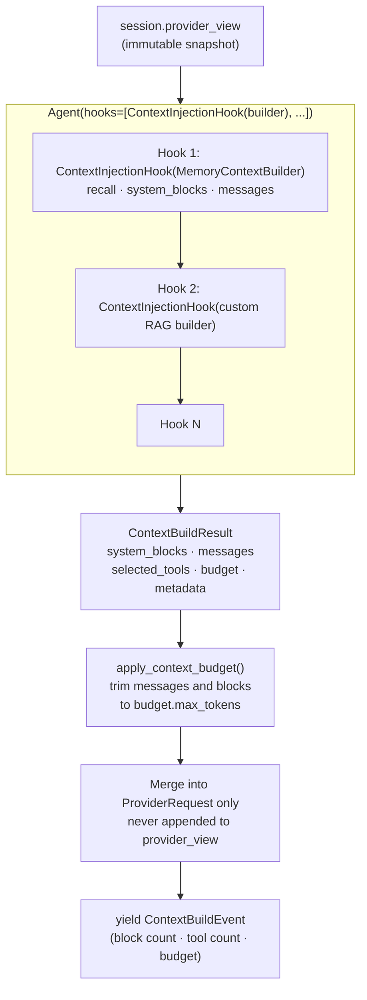

**Rules:**
- Builder output is **ephemeral** — appended only to `ProviderRequest`, never to `session.provider_view` or `full_history`.
- `ContextBudget(max_tokens=N)` trims messages and system blocks before the request is sent.
- `selected_tools` narrows the provider schema list for this turn only; `session.agent.tools` is not mutated.
- Multiple `ContextInjectionHook`s can be registered; each receives the same unmodified view snapshot and their outputs are merged and re-budgeted as a whole.
- Builders must not block — use `await` for I/O.

---

### 3.5 Session History Model

Two separate lists track conversation history; only one is ever sent to the LLM.

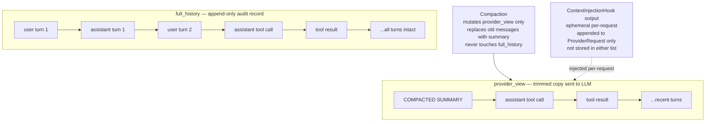

**Invariant:** `full_history` is a strict superset of the logical conversation. Do not write to it outside the `loop/` package.

---

### 3.6 Permission Evaluation

Every tool call passes through the permission engine before reaching the scheduler.
For durable resume, allow/deny decisions made during a turn are snapshotted in
`RunCheckpoint.permission_decisions`. On resume of the same checkpointed turn,
the scheduler replays those decisions before invoking `canUseTool`; on the next
fresh turn, `session.current_turn_permission_decisions` is cleared so approvals
cannot leak across turns.

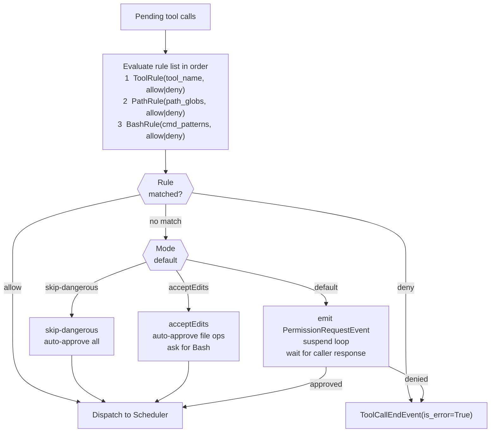

---

### 3.7 Memory and RAG Layer

Core ships a pluggable protocol with in-memory and durable reference implementations. Vector databases, embedding clients, and graph stores are host-owned and inject via the same protocol.

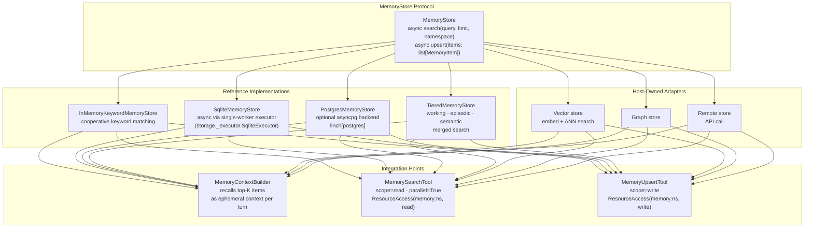

`TieredMemoryStore` is still a `MemoryStore`: it routes writes by
`MemoryItem.metadata["tier"]` (`working`, `episodic`, or `semantic`) and merges
search results across tiers with optional per-tier limits. Unknown or malformed
tier metadata falls back to `working`. `MemorySearchTool` preserves result ids,
tier counts, and citation tier metadata so run reports and eval scorers can
measure recall behavior in long-running sessions.

`RunReport.long_run` synthesizes long-horizon signals from the event stream and
checkpoint: context trimming and selected tools, memory searches/upserts,
recalled ids, tier counts, failed tool calls, recovery hints, completion, cost,
and resume phase. The eval package includes companion scorers for context
selection, context trimming, context metadata, memory recall, recovery after
tool failures, and successful completion.

Do not add vector database or embedding dependencies to core; adapters implement the protocol and live in examples.

---

### 3.8 Virtual Filesystem and Large-Result Offloading

Variable-length tool results (RAG, web search, large file reads) are the primary
cause of context-window blowup. The filesystem subsystem mirrors the Deep Agents
`FilesystemMiddleware` pattern: when a tool result exceeds a token threshold, the
scheduler writes the full payload to a `FileBackend` and substitutes a short
preview + path reference in `provider_view`. The model reads back only the slices
it needs via the `read_file` tool.

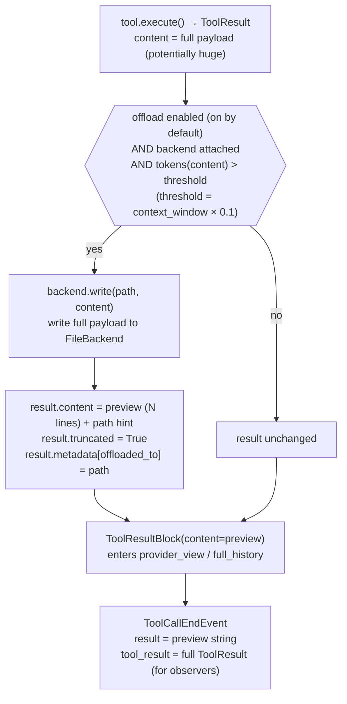

**Backends** — all implement the same `FileBackend` protocol:

| Backend | Storage | Lifecycle | Use when |
|---|---|---|---|
| `StateFileBackend` | In-memory dict | Per-session (default) | Zero-overhead ephemeral scratch |
| `DiskFileBackend` | Real files under a root dir | Until deleted | Want human-inspectable files; root defaults to `.linch/offload` (gitignored) |
| `SqliteFileBackend` | SQLite table | Persistent across sessions | Need cross-session recall (e.g. `/memories/`) |
| `CompositeFileBackend` | Routes by path prefix | Mixed | Ephemeral scratch + persistent `/memories/` subtree |

**`FileBackend` protocol** — five async methods:

```python
class FileBackend(Protocol):
    async def read(self, path, *, offset=0, limit=None) -> str: ...
    async def write(self, path, content) -> None: ...
    async def ls(self, prefix="") -> list[str]: ...
    async def edit(self, path, old, new, *, replace_all=False) -> int: ...
    async def exists(self, path) -> bool: ...
    async def delete(self, path) -> None: ...
```

**Four tools** are registered automatically when a backend is configured:

| Tool | Scope | Description |
|---|---|---|
| `ls` | read | List virtual files, optionally filtered by prefix |
| `read_file` | read | Read a file with optional offset/limit line window |
| `write_file` | write | Write or overwrite a scratchpad file |
| `edit_file` | write | Exact-string replace within a file |

**Invariant:** offloading mutates only `ToolResult.content` before the
`ToolResultBlock` is built. The full `ToolResult` still rides on
`ToolCallEndEvent.tool_result` for observers. `full_history` contains the preview,
not the raw payload — matching the session's context budget.

---

## 4. Event Taxonomy

All events are `@dataclass(slots=True)` with a `type: Literal[...]` discriminator. Every cross-cutting concern surfaces through events; callers never poll internal state.

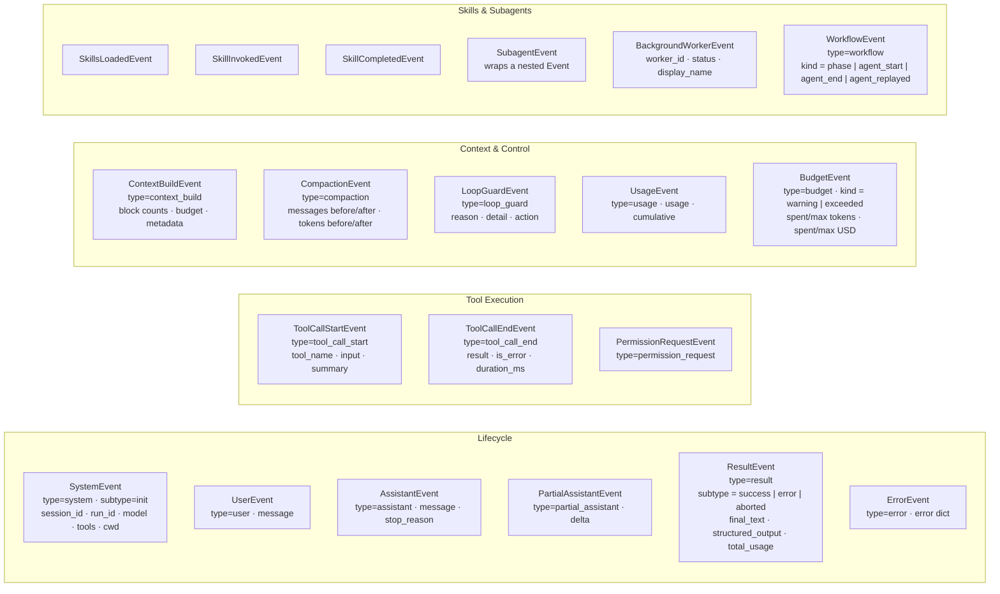

`BackgroundWorkerEvent` is emitted when a background worker task completes (success or failure); it carries `worker_id`, `status`, and `display_name`.

`event_to_dict` and `event_from_dict` in `events.py` provide full round-trip serialization for all event types.

---

## 5. Key Data Types

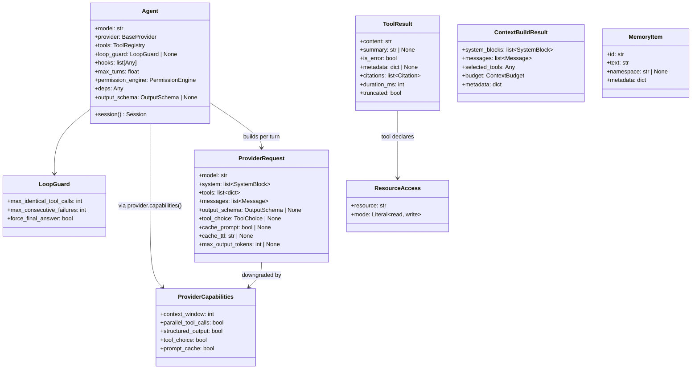

---

## 6. Module Inventory

| Module | Responsibility |
|--------|---------------|
| `agent.py` | Immutable config; system block assembly; `session()` factory |
| `session.py` | Per-conversation state: `provider_view`, `full_history`, `run_deps`, `RunOptions` |
| `loop/` | Turn orchestration (`runner.py`), streaming + `ContextLengthError` recovery (`streaming.py`), `ProviderRequest` assembly (`request.py`), terminal event tails + gate evaluation (`terminals.py`), event persistence + checkpoint serialization (`checkpoint.py`) |
| `types.py` | Shared dataclasses: `Message`, `ContentBlock`, `ProviderRequest`, `OutputSchema` |
| `events.py` | All event dataclasses + round-trip serialization (`event_to_dict` / `event_from_dict`) |
| `config.py` | `FeatureFlags`, `SystemPromptConfig` |
| `context/` | `ContextBuilder` protocol, `ContextBuildResult`, `ContextBudget`, `apply_context_budget`; consumed by `ContextInjectionHook` in `hooks/adapters.py` |
| `loop_guard/` | `LoopGuard`, `LoopGuardState`, `LoopGuardDecision`, `evaluate_loop_guard`, `normalize_loop_guard` |
| `memory/` | `MemoryStore` protocol, reference stores including `TieredMemoryStore`, `MemoryContextBuilder`, memory tools |
| `filesystem/` | `FileBackend` protocol, `StateFileBackend`, `DiskFileBackend`, `SqliteFileBackend`, `CompositeFileBackend`, `OffloadConfig`, ls/read_file/write_file/edit_file tools |
| `scheduler.py` | Resource-aware parallel tool execution with concurrency cap; applies `maybe_offload` at the result chokepoint |
| `compaction.py` | Context-window management; calls `agent.provider` directly; `CompactionLadder` + `micro_compact` recovery rungs |
| `budget.py` | `RunBudget` — token/USD spending caps shared across the agent tree; charged per turn in `loop/runner.py` |
| `workflow/` | Deterministic workflow engine: `WorkflowContext` (`context.py`), content-addressed journal (`journal.py`), `run_workflow` driver (`engine.py`) |
| `permissions/` | `PermissionEngine`: rule evaluation, event emission, loop suspension, durable permission decision keys |
| `pricing.py` | `ModelPricing`, `_DEFAULT_PRICING`, `cost_usd()` for per-turn and cumulative cost events |
| `evals/` | Scripted provider, eval case/result dataclasses, built-in scorers, `run_eval()` |
| `providers/` | `BaseProvider`, `ProviderCapabilities`; implementations: `OpenAIChatCompletionsProvider` (any OpenAI-compatible endpoint, `reasoning_content` round-trip for DeepSeek/o-series), `OpenAIResponsesProvider` (stateful, native reasoning effort/summary), `AnthropicProvider` (extended thinking with signature, prompt caching), `GeminiProvider`, `LlamaCppProvider` |
| `tools/` | Tool protocol, `ToolContext`, `ToolRegistry`, `ToolResult`, `Citation`, built-in tools, execution backends |
| `sessions/` | `SessionStore` protocol, `InMemorySessionStore`, `SqliteSessionStore` |
| `mcp/` | MCP server connection → Linch tool adapters |
| `skills/` | `SKILL.md`-based slash-commands with argument substitution |
| `subagents/` | Specialized agent roles from `.linch/agents.yaml`; `workers.py` — `WorkerHandle` dataclass for per-worker state tracking; wiring for `SubagentContinueTool` |
| `run_store.py` | `SqliteRunStore`, `RunCheckpoint` — durable run-level checkpoint/resume storage; `RunCheckpoint` stores background workers and current-turn permission decisions |
| `deep_agent/` | `create_deep_agent` factory (`factory.py`); deep prompt layers (`prompts.py`); specialist subagent roster — researcher, planner, implementer (`subagents.py`) |
| `tools/subagent_continue.py` | `SubagentContinueTool` — continues a retained child session by worker id or display name |
| `tools/subagent_stop.py` | `TaskStopTool` — cancels a background worker; handle remains in `session.workers` and is still continuable |
| `tools/_worker_utils.py` | `resolve_worker` — shared id/display-name lookup helper used by continue and stop tools |
| `recipes/` | *(removed)* — use `Agent(...)` directly; see `examples/` for domain patterns |

---

## 7. Provider Contract

Every provider implements `BaseProvider` (three methods):

```python
class BaseProvider(ABC):
    id: str

    def context_window(self, model: str) -> int: ...

    async def stream(self, req: ProviderRequest) -> AsyncIterator[dict[str, object]]: ...

    def capabilities(self, model: str) -> ProviderCapabilities:
        # Default derives context_window only; override to declare full support
        return ProviderCapabilities(context_window=self.context_window(model))
```

`stream()` yields **normalized dicts** — never raw API objects. Required keys by event type:

| `type` value | Required additional keys |
|---|---|
| `"message_start"` | `model: str` |
| `"text_delta"` | `text: str` |
| `"tool_use_start"` | `id: str`, `name: str` |
| `"tool_use_input_delta"` | `id: str`, `json_delta: str` |
| `"tool_use_end"` | `id: str` |
| `"thinking_delta"` | `text: str`, `signature?: str` |
| `"message_end"` | `stop_reason: StopReason`, `usage: Usage`, `provider_metadata: Any` |

The loop assembles these — it never imports any provider's raw types. Adding a new provider means implementing this dict contract only.

---

## 8. Tool Protocol

For normal application tools, prefer the `@tool` helper. It wraps a sync or
async Python function in a regular Tool-compatible object, infers a minimal JSON
schema, injects `ToolContext` when the function asks for `ctx`, and converts
plain return values into `ToolResult`.

```python
from linch import ToolContext, tool

@tool(description="Search the product knowledge base.", tags=("rag",))
async def search_kb(query: str, ctx: ToolContext) -> str:
    return await ctx.deps.kb.search(query)
```

The runtime still consumes the same **duck-typed** protocol — no base class, no
`isinstance` check anywhere in the core. `FunctionTool` implements this shape,
and advanced tools can implement it directly:

```python
class MyTool:
    name: str                                      # unique registry key
    description: str                               # shown to the model
    input_schema: dict                             # JSON Schema object
    scope: Literal["read", "write", "exec"]
    parallel: bool                                 # V2 concurrency flag

    # Optional Phase-11 reliability attributes (all duck-typed via getattr)
    execution_timeout_ms: float                    # per-tool timeout; 0 = opt-out
    retryable: bool                                # opt write/exec tool into retry

    def validate(self, raw: dict) -> dict: ...
    def resources(self, input: dict) -> list[ResourceAccess]: ...
    async def execute(self, input: dict, ctx: ToolContext) -> ToolResult: ...
    def summarize(self, input: dict) -> str: ...   # one-line for logs
```

`ToolContext` carries: `cwd`, `session_id`, `run_id`, `session_store`, `signal` (abort), `file_read_tracker`, `deps`, `filesystem`.

`deps` is threaded from `Agent(deps=...)` or overridden per-run with `RunOptions(deps=...)`. Use it to inject app state into tools without globals.

`BashTool` delegates command execution to a backend. `LocalBackend` preserves
the default local subprocess behavior with timeout cleanup; `DockerBackend`
uses `docker run --rm` when the Docker daemon is available. Passing
`Agent(execution_backend=...)` replaces an existing `Bash` tool only, so a
restricted registry that omits `Bash` does not gain shell access.

Permissions and execution backends are separate layers. `ToolRule`, `PathRule`,
and `BashRule` determine whether a tool call may run. If a Bash call is
approved, the configured backend determines the runtime boundary. `DockerBackend`
defaults remain compatibility-first: writable workspace mount, Docker default
network, no environment forwarding, and no read-only root filesystem. Opt-in
controls such as `network="none"`, `workspace_mount="ro"`,
`read_only_root=True`, `tmpfs=(...)`, `env={...}`, `forward_env=(...)`, and
`user="1000:1000"` restrict approved Bash commands inside the container.

### ToolRegistry

```python
registry.add(tool)                        # add; raises if name exists
registry.remove(name)                     # remove by name
registry.replace(tool)                    # swap same-named tool
registry.select(names={...}, tags={...})  # runtime subset (per-request)
registry.copy()                           # shallow clone
registry.schemas()                        # provider-ready schema list
empty_tools(*extra)                       # no built-ins + optional extras
tools_from_defaults(exclude, extra)       # standard set ± named tools
```

---

## 9. System Prompt Layers

`Agent._build_system_blocks(tool_names)` assembles the system prompt from
ordered layers. `SystemPromptConfig.sections` can insert named reusable
sections before defaults, after defaults, or after the environment block without
changing the built-in prompt text:

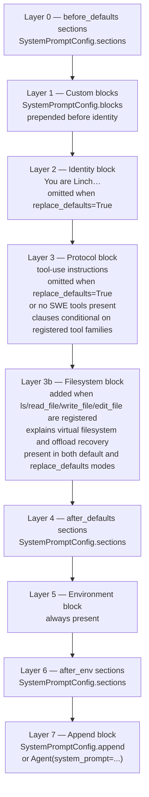

**Invariant:** when the full default toolset is registered and `replace_defaults=False`, the protocol block is byte-identical to the pinned reference in `tests/test_system_blocks.py`. Change the wording only intentionally and update the parity test.

---

## 10. Structured Output Paths

Two independent mechanisms surface the same field: `ResultEvent.structured_output: dict | None`.


Path B is more reliable for complex schemas and works across all providers without `response_format` support.

---

## 11. Compaction

`maybe_compact(session, agent)` is called at the top of each turn:

1. Count tokens in `provider_view` via `agent.provider.context_window(agent.model)`.
2. If within threshold — no-op.
3. Otherwise submit a summarization request via `agent.provider.stream()` and replace old messages in `provider_view` with the summary, emitting `CompactionEvent`.

**Invariant:** `full_history` is never modified. Only `provider_view` shrinks. Compaction uses the configured `agent.provider` — never a hardcoded OpenAI call.

`DefaultCompaction` remains the default. `DetailedCompaction` is opt-in via
`Agent(compaction=DetailedCompaction())` and uses a continuation-safe summary
with user intent, artifacts/files/code touched, errors/fixes, pending tasks,
current work, and the next step.

### Compaction ladder (opt-in)

`Agent(compaction_ladder=CompactionLadder())` adds recovery rungs around the
strategy; with the default `compaction_ladder=None` the behavior above is
byte-identical.

- **Rung 1 — micro-compact** (`micro_compact` in `compaction.py`): elide
  `ToolResultBlock` contents older than `keep_recent_turns` with a short
  placeholder. No LLM call; copy-on-write (blocks are shared with
  `full_history`, so changed messages are rebuilt, never mutated); every
  `tool_use_id` stays paired. Runs proactively inside `maybe_compact` (skips
  summarization when elision frees enough) and reactively, once per turn, when
  the provider raises `ContextLengthError`.
- **Rung 2 — forced compaction with a circuit breaker**: the reactive path
  (`_stream_turn_with_ladder` in `loop/streaming.py`) retries with forced compactions up
  to `max_forced_compactions` per run, then lets the error surface. The legacy
  path (no ladder) keeps its original single-retry-per-turn semantics in
  `_stream_turn_with_compaction_retry`.

---

## 12. Skills and Subagents

**Skills** are loaded from `.linch/skills/*/SKILL.md`; built-in skills
such as `verify` are also registered unless a disk skill uses the same name.
Each file has YAML frontmatter (`name`, `description`, `allowed_tools`,
`model_override`) and a markdown body. When a skill is invoked, the body is
injected as a `<system-reminder>` per-turn via `_re_inject_skill_context`.
Gated by `FeatureFlags(skills=True)`.

**Subagents** are defined in `.linch/agents/*.md`; built-in named agents
such as `verification` are also registered unless a disk agent uses the same
name. `subagents/runner.py` creates a child agent with its own tool overlay and
system prompt. The child's system blocks are computed from its own tool names —
not copied from the parent. Gated by `FeatureFlags(subagents=True)`.

**MCP** — `connect_mcp_servers(configs)` wraps each MCP tool as a duck-typed Linch tool. Names are normalized via `mcp/naming.py`. The connection closes on `agent.close()`. Gated by `FeatureFlags(mcp=True)`.

### Deep agent preset (`deep_agent/`)

`create_deep_agent(model, durable, coordinator, cwd, ...)` is a factory that assembles a full deep-agent configuration in one call: task tools, a specialist subagent roster (researcher, planner, implementer), durable stores, a persistent `/memories` filesystem, and a deepened system prompt.

- **`coordinator=True`** — the parent agent strips heavy tools (`Edit`, `Write`, `Bash`, `Grep`, `Glob`, `Read`); `COORDINATOR_SYSTEM_PROMPT` is injected via `SystemPromptConfig`; `TaskStopTool` is registered on the coordinator. Worker subagents receive full tool access via `build_child_tools`.
- **`durable=True`** — wires `SqliteSessionStore` + `SqliteRunStore` + `CompositeFileBackend` with a `/memories` route to `SqliteFileBackend` so memory persists across restarts.

### Background workers and fork/continue

- `SubagentTool` always passes `retain=True` so the child session stays live in `agent._sessions` after the run ends.
- `session.workers: dict[str, WorkerHandle]` indexes every spawned worker by `worker_id`.
- **`run_in_background=True`** on `SubagentTool`: spawns `asyncio.create_task(_bg_run())` and returns an acknowledgement immediately. On completion, the task appends a `<task-notification>` XML `Message` to `session.pending_notifications`.
- The loop drains `session.pending_notifications` at the top of each turn (`_drain_pending_notifications`), yielding each notification as a `UserEvent` before `ContextInjectionHook.build_context()` runs, so the model sees task-completion content before the next provider call.
- `SubagentContinueTool` resolves a worker by id or display name via `resolve_worker`, then calls `continue_subagent()`, which re-drives the live child session using the full prior `provider_view`.
- `TaskStopTool` cancels the background `asyncio.Task` and signals abort on the child session; the `WorkerHandle` remains in `session.workers` so the worker can be continued later.
- `session.abort()` and `agent.close()` both cancel all running background worker tasks. `agent.close()` additionally clears `agent._sessions`.

### Run budgets (`budget.py`)

`RunBudget` is a plain mutable accumulator capping tokens and/or USD for a run
**and its whole subagent tree**. Resolution order in `run_loop`:
`RunOptions.budget` → `session.inherited_budget` (set on child sessions by
`run_subagent` from the parent's `active_budget`) → `Agent(budget=...)`. The
loop charges the budget after every provider turn (next to the `UsageEvent`)
and checks `exceeded` before each turn; exhaustion emits
`BudgetEvent(kind="exceeded")` → `ErrorEvent(BudgetExceededError)` →
`ResultEvent(subtype="error")` and stops gracefully — history intact, session
reusable. A `BudgetEvent(kind="warning")` fires once per budget object at
`warn_ratio` (default 0.9). Because parent and children charge the *same
object*, child spending is visible to the parent's next pre-call check.

### Workflow engine (`workflow/`)

`agent.run_workflow(fn)` drives a deterministic "closed fleet loop": *fn* is a
plain async function receiving a `WorkflowContext` (`wf`) and orchestrating
subagents via `wf.agent` / `wf.parallel` / `wf.pipeline` / `wf.phase`, with
`wf.budget` exposing the shared `RunBudget`.

- A host session parents every `wf.agent` run (each is a normal
  `run_subagent` child); child `SubagentEvent`s and `WorkflowEvent`s reach the
  host via the `on_event` callback.
- **Journal = the run event log.** With `Agent(run_store=...)` and a
  `run_id`, each `wf.agent` result persists as
  `WorkflowEvent(kind="agent_end")`. Re-invoking with the same `run_id` folds
  the stored events back into a `WorkflowJournal` and replays the unchanged
  call prefix (`kind="agent_replayed"`, no provider call). Calls are keyed by
  `sha256(subagent_type, prompt)` + per-key occurrence counter, so parallel
  fan-out replays safely and an edited prompt invalidates only that call.
- The workflow function must be deterministic (no random/time-based
  branching) for resume replay to be correct.

---

## 13. Key Invariants

These must not break across refactors:

| # | Invariant |
|---|---|
| 1 | **`full_history` is append-only** — only the `loop/` package appends; never write to it elsewhere. |
| 2 | **`provider_view` is the only thing compaction mutates** — `full_history` is untouched. |
| 3 | **Tool protocol is duck-typed** — no base class, no `isinstance`; check attribute presence. |
| 4 | **`stream()` yields normalized dicts** — the loop must not import any provider's raw types. |
| 5 | **Default SWE system-block text is pinned** — `test_system_blocks.py` has a byte-identical parity assertion; update it intentionally. |
| 6 | **`final_tool_name` tool is never scheduled** — the loop intercepts before the scheduler. |
| 7 | **Context builders do not mutate history** — they receive a `provider_view` snapshot and return ephemeral request context. |
| 8 | **`run_deps` is set once per `run_loop` call** — at the top, from `opts.deps ?? agent.deps`. |
| 9 | **Loop guard is on by default** — `Agent()` without `loop_guard=` gets `LoopGuard()` with safe thresholds; disable explicitly with `Agent(loop_guard=None)`. |
| 10 | **Provider capabilities apply per-request** — `loop/request.py` always calls `apply_provider_capabilities()` when the provider has `capabilities()`; no provider receives features it declared unsupported. |
| 11 | **Offload only replaces `ToolResult.content` before block construction** — the full result is preserved on `ToolCallEndEvent.tool_result`; `full_history` and `provider_view` receive the preview only. `maybe_offload` never raises — a backend write failure silently returns the original result so a storage hiccup never breaks a run. |
| 12 | **Filesystem tools are excluded from offloading** — `read_file`, `write_file`, `edit_file`, `ls` are in `OffloadConfig.skip_tools` by default; reading a large file back cannot trigger a recursive re-offload. |
| 13 | **Background workers are cancelled at both exit paths** — `_cancel_background_workers(session)` is called in both the `except AbortError` and `except Exception` handlers in `run_loop`. Worker tasks must never write into a session whose run has already ended. |
| 14 | **`SubagentTool` always uses `retain=True`** — child sessions remain in `agent._sessions` until `agent.close()` clears them. `continue_subagent` relies on the child session being live; removing it would silently break fork/continue. |
| 15 | **`session.pending_notifications` is drained before `ContextInjectionHook.build_context()`** — `_drain_pending_notifications` converts each queued `<task-notification>` Message into a `UserEvent` at the top of every new turn, so the model sees background task results before the next provider call. |
| 16 | **One `RunBudget` object per agent tree** — children inherit the parent's `active_budget` by reference in `run_subagent`; charging happens only in `run_loop` next to the `UsageEvent`. Never copy a budget into a child. |
| 17 | **`micro_compact` is copy-on-write** — provider-view messages/blocks are shared with `full_history`; elision must build new `Message`/`ToolResultBlock` objects, never mutate in place. With `compaction_ladder=None` the compaction/retry event sequence is byte-identical to the pre-ladder code (pinned by `test_ladder_disabled_is_byte_identical`). |
| 18 | **Workflow journal records are append-only `WorkflowEvent`s in the run store** — replay correctness depends on `agent_end`/`agent_replayed` events being persisted for every completed `wf.agent` call; do not emit them for failed calls. |
| 19 | **Persisted wire formats are versioned and forward-tolerant** — `checkpoint_to_dict` stamps `schema_version` (`linch.RUN_SCHEMA_VERSION`); `checkpoint_from_dict` reads field-by-field with defaults (a newer checkpoint round-trips its known fields), and `load_events` skips an undecodable event row rather than aborting the resume. Bump `SCHEMA_VERSION` only on a breaking shape change. |
| 20 | **The public API surface is exactly `linch.__all__`** — `tests/test_public_api.py` enforces that every name resolves, there are no duplicates, and no public (non-underscore) attribute leaks onto the package undeclared. Changing the surface is a deliberate, reviewable edit; `docs/versioning.md` is the semver contract. |
| 21 | **The event stream is a plain async generator** — `session.run()`/`resume()` `yield` events directly from `run_loop`; there is no unbounded internal queue, so a slow consumer applies backpressure to the whole producer. Do not wrap the loop in an unbounded buffering task. |
| 22 | **No process-global mutable state** — every `Agent` builds its own registries/stores/engines so N agents are multi-tenant-isolated; `session.abort()` and `agent.close()` both drain background-worker *and* background-tool tasks. |
