# AgentKit Architecture

Professional reference for the V2 harness. Covers every subsystem, its contract, the complete data flow, and the invariants that must not break.

---

## 1. System Overview

The framework is a harness of pluggable subsystems composed around a single event-driven loop. The caller only interacts with `Agent` (config) and `Session` (state); everything else is internal machinery wired together inside `run_loop`.

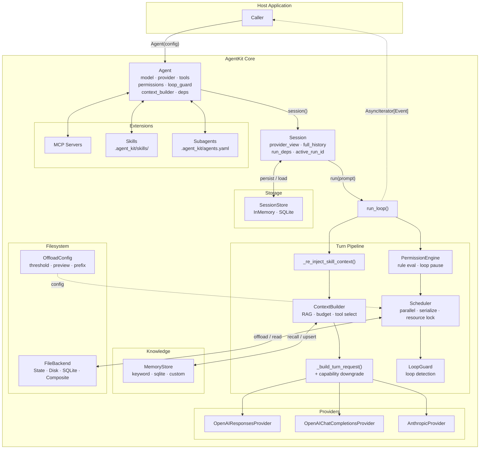

---

## 2. Turn Lifecycle

One complete agent turn — from receiving the prompt to deciding whether to continue looping.

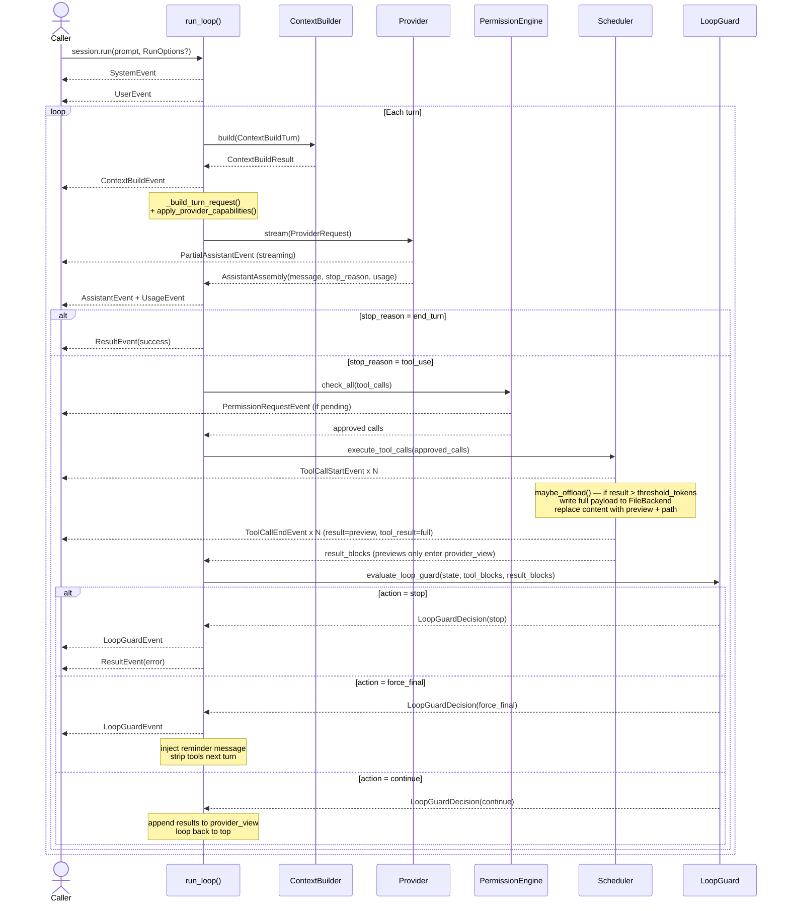

---

## 3. Subsystems

### 3.1 Scheduler — Parallel & Serialized Execution

The scheduler is the only place tool calls are executed. It enforces concurrency policies and resource conflict rules before dispatching.

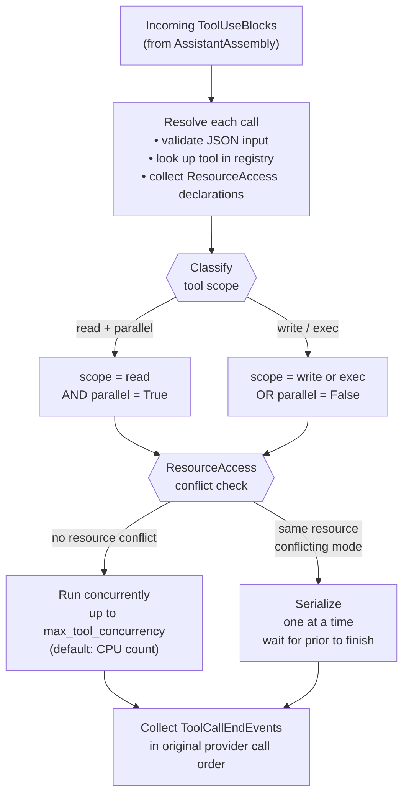

**Rules:**
- `scope="read"` + `parallel=True` → may run concurrently up to `Agent(max_tool_concurrency=N)` or env `AGENTKIT_MAX_TOOL_CONCURRENCY`.
- `scope="write"` or `scope="exec"` → always serialize, regardless of `parallel` flag.
- `ResourceAccess(resource, mode)` enables finer conflict detection: two `"read"` accesses on the same resource overlap freely; any `"write"` on a resource being read or written by another call serializes.
- Result events are emitted in the **original provider tool-call order**, not completion order.
- **Timeouts** — `Agent(tool_timeout_ms=N)` (env `AGENTKIT_TOOL_TIMEOUT_MS`) sets an agent-wide execution deadline. Per-tool override: `execution_timeout_ms` class attribute (`0` = opt-out). Timeout → `is_error=True` result, run continues. Uses `asyncio.wait_for` (Python 3.10 safe). `ToolTimeoutError` (`retryable=True`) is the typed exception class.
- **Retry** — `Agent(tool_retry=RetryOptions(...))` enables opt-in exponential-backoff retry. Read-scope tools retry any exception; write/exec tools only retry when the tool sets `retryable = True`. `AbortError` is never retried.

---

### 3.2 Loop Guard — Agentic Loop Detection

Detects obvious runaway loops cheaply (no extra LLM call) and terminates cleanly.

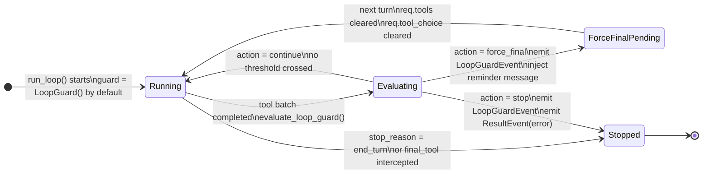

**Trip conditions** — `evaluate_loop_guard` checks after every tool batch:

| Check | Threshold | Config field |
|---|---|---|
| Repeated identical call | `call_counts[name:sorted_json] >= N` | `max_identical_tool_calls` (default `3`) |
| Consecutive failure streak | all tools errored for N batches in a row | `max_consecutive_failures` (default `3`) |
| Max turns | `range(max_turns)` exhausted | `Agent(max_turns=N)` emits `LoopGuardEvent(reason="max_turns")` |

`force_final_answer=True` injects a `<system-reminder>` message and strips `req.tools = []` for one final turn so the model must answer in text.

---

### 3.3 Provider Capabilities — Request Downgrade

Every provider declares its feature support. `_build_turn_request` applies downgrades so no provider receives flags it cannot handle.

```mermaid
flowchart LR
    OPTS["Agent / RunOptions\noutput_schema\ntool_choice\ncache_prompt = True\ncache_ttl"]

    REQ["ProviderRequest\n(initial build)"]

    CAPS["provider.capabilities(model)\nProviderCapabilities"]

    APPLY["apply_provider_capabilities(req, caps)"]

    C1{{"prompt_cache\n= False?"}}
    C2{{"tool_choice\n= False?"}}
    C3{{"structured_output\n= False?"}}

    D1["clear cache_prompt\nclear cache_ttl"]
    D2["clear tool_choice"]
    D3["clear output_schema\nloop text-parses response instead"]

    FINAL["ProviderRequest\n(provider-ready)"]

    OPTS --> REQ --> CAPS --> APPLY
    APPLY --> C1
    C1 -->|"yes"| D1 --> C2
    C1 -->|"no"| C2
    C2 -->|"yes"| D2 --> C3
    C2 -->|"no"| C3
    C3 -->|"yes"| D3 --> FINAL
    C3 -->|"no"| FINAL
```

**Declared capabilities per provider:**

| Provider | `prompt_cache` | `structured_output` | `tool_choice` |
|---|---|---|---|
| `OpenAIResponsesProvider` | ✗ | ✓ | ✓ |
| `OpenAIChatCompletionsProvider` | ✗ | ✓ | ✓ |
| `AnthropicProvider` | ✓ | ✗ | ✓ |

Duck-typed test fakes that omit `capabilities()` are safely skipped via a `hasattr` guard — no test changes required when adding new providers.

---

### 3.4 Context Building Pipeline

Context builders fire before every provider call, injecting ephemeral context without mutating conversation history.

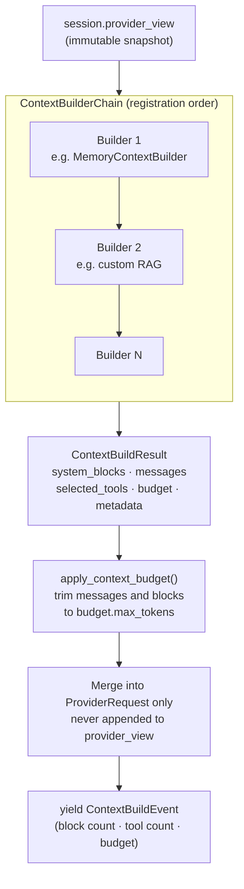

**Rules:**
- Builder output is **ephemeral** — appended only to `ProviderRequest`, never to `session.provider_view` or `full_history`.
- `ContextBudget(max_tokens=N)` trims messages and system blocks before the request is sent.
- `selected_tools` narrows the provider schema list for this turn only; `session.agent.tools` is not mutated.
- Multiple builders compose via `ContextBuilderChain`; each receives the same unmodified view snapshot.
- Builders must not block — use `await` for I/O.

---

### 3.5 Session History Model

Two separate lists track conversation history; only one is ever sent to the LLM.

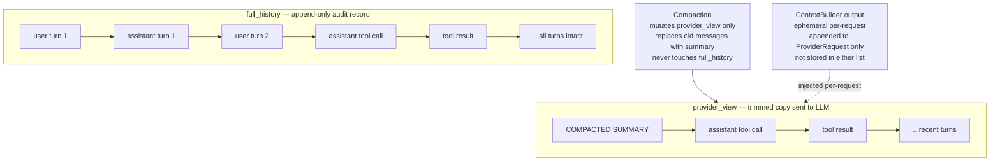

**Invariant:** `full_history` is a strict superset of the logical conversation. Do not write to it outside `loop.py`.

---

### 3.6 Permission Evaluation

Every tool call passes through the permission engine before reaching the scheduler.

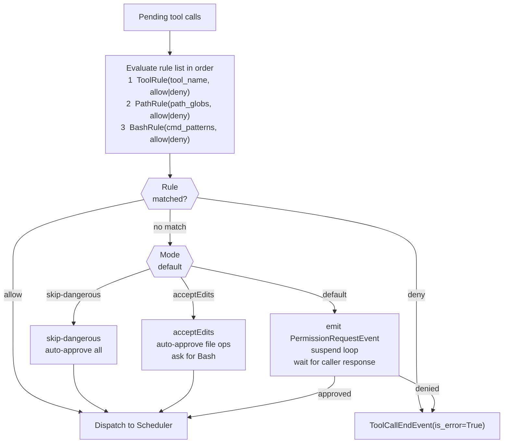

---

### 3.7 Memory and RAG Layer

Core ships a pluggable protocol with two reference implementations. Vector databases, embedding clients, and graph stores are host-owned and inject via the same protocol.

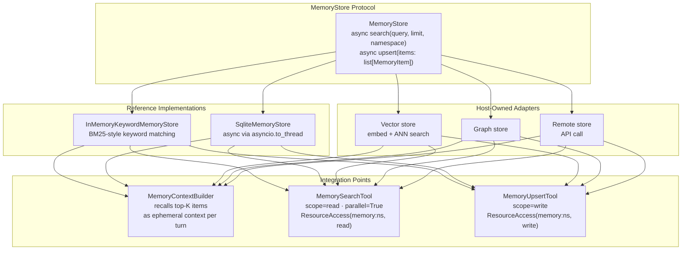

Do not add vector database or embedding dependencies to core; adapters implement the protocol and live in examples or recipes.

---

### 3.8 Virtual Filesystem and Large-Result Offloading

Variable-length tool results (RAG, web search, large file reads) are the primary
cause of context-window blowup. The filesystem subsystem mirrors the Deep Agents
`FilesystemMiddleware` pattern: when a tool result exceeds a token threshold, the
scheduler writes the full payload to a `FileBackend` and substitutes a short
preview + path reference in `provider_view`. The model reads back only the slices
it needs via the `read_file` tool.

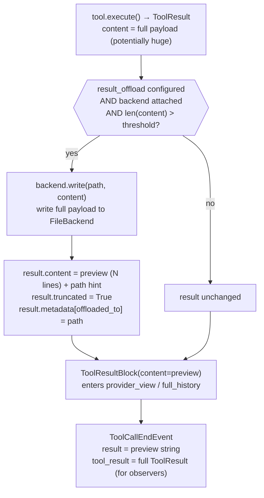

**Backends** — all implement the same `FileBackend` protocol:

| Backend | Storage | Lifecycle | Use when |
|---|---|---|---|
| `StateFileBackend` | In-memory dict | Per-session (default) | Zero-overhead ephemeral scratch |
| `DiskFileBackend` | Real files under a root dir | Until deleted | Want human-inspectable files; root defaults to `.agent_kit/offload` (gitignored) |
| `SqliteFileBackend` | SQLite table | Persistent across sessions | Need cross-session recall (e.g. `/memories/`) |
| `CompositeFileBackend` | Routes by path prefix | Mixed | Ephemeral scratch + persistent `/memories/` subtree |

**`FileBackend` protocol** — five async methods:

```python
class FileBackend(Protocol):
    async def read(self, path, *, offset=0, limit=None) -> str: ...
    async def write(self, path, content) -> None: ...
    async def ls(self, prefix="") -> list[str]: ...
    async def edit(self, path, old, new, *, replace_all=False) -> int: ...
    async def exists(self, path) -> bool: ...
    async def delete(self, path) -> None: ...
```

**Four tools** are registered automatically when a backend is configured:

| Tool | Scope | Description |
|---|---|---|
| `ls` | read | List virtual files, optionally filtered by prefix |
| `read_file` | read | Read a file with optional offset/limit line window |
| `write_file` | write | Write or overwrite a scratchpad file |
| `edit_file` | write | Exact-string replace within a file |

**Invariant:** offloading mutates only `ToolResult.content` before the
`ToolResultBlock` is built. The full `ToolResult` still rides on
`ToolCallEndEvent.tool_result` for observers. `full_history` contains the preview,
not the raw payload — matching the session's context budget.

---

## 4. Event Taxonomy

All events are `@dataclass(slots=True)` with a `type: Literal[...]` discriminator. Every cross-cutting concern surfaces through events; callers never poll internal state.

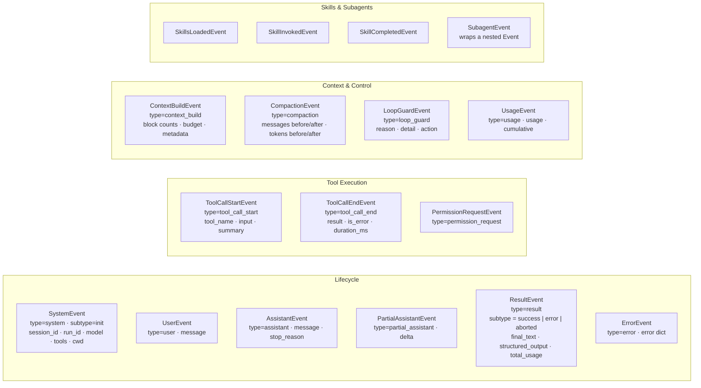

`event_to_dict` and `event_from_dict` in `events.py` provide full round-trip serialization for all event types.

---

## 5. Key Data Types

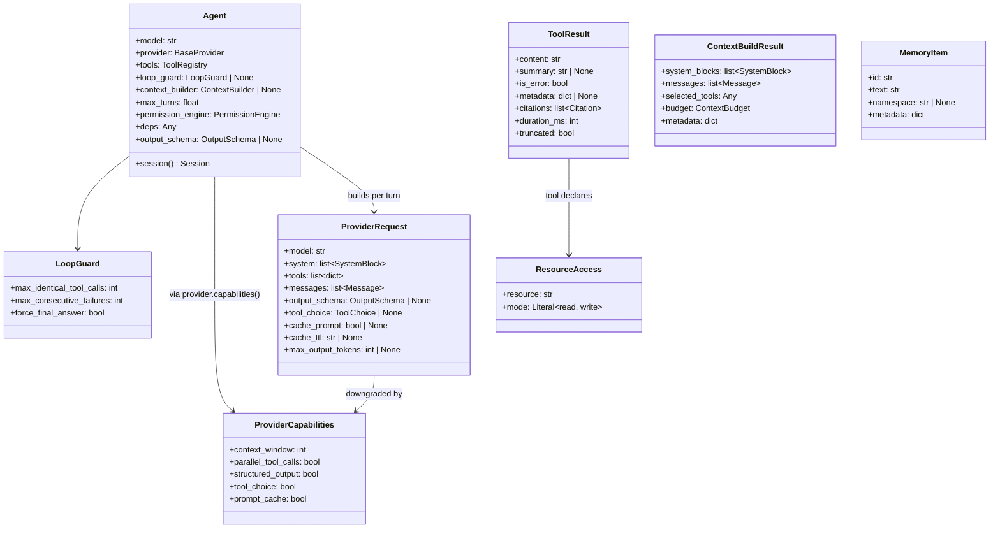

---

## 6. Module Inventory

| Module | Responsibility |
|--------|---------------|
| `agent.py` | Immutable config; system block assembly; `session()` factory |
| `session.py` | Per-conversation state: `provider_view`, `full_history`, `run_deps`, `RunOptions` |
| `loop.py` | Turn orchestration, event emission, compaction trigger, loop guard wiring, capability downgrade |
| `types.py` | Shared dataclasses: `Message`, `ContentBlock`, `ProviderRequest`, `OutputSchema` |
| `events.py` | All event dataclasses + round-trip serialization (`event_to_dict` / `event_from_dict`) |
| `config.py` | `FeatureFlags`, `SystemPromptConfig` |
| `context/` | `ContextBuilder`, `ContextBuildResult`, `ContextBudget`, `ContextBuilderChain` |
| `loop_guard/` | `LoopGuard`, `LoopGuardState`, `LoopGuardDecision`, `evaluate_loop_guard`, `normalize_loop_guard` |
| `memory/` | `MemoryStore` protocol, reference stores, `MemoryContextBuilder`, memory tools |
| `filesystem/` | `FileBackend` protocol, `StateFileBackend`, `DiskFileBackend`, `SqliteFileBackend`, `CompositeFileBackend`, `OffloadConfig`, ls/read_file/write_file/edit_file tools |
| `scheduler.py` | Resource-aware parallel tool execution with concurrency cap; applies `maybe_offload` at the result chokepoint |
| `compaction.py` | Context-window management; calls `agent.provider` directly |
| `permissions/` | `PermissionEngine`: rule evaluation, event emission, loop suspension |
| `providers/` | `BaseProvider`, `ProviderCapabilities`, OpenAI Chat, OpenAI Responses, Anthropic |
| `tools/` | Tool protocol, `ToolContext`, `ToolRegistry`, `ToolResult`, `Citation`, built-in tools |
| `sessions/` | `SessionStore` protocol, `InMemorySessionStore`, `SqliteSessionStore` |
| `mcp/` | MCP server connection → AgentKit tool adapters |
| `skills/` | `SKILL.md`-based slash-commands with argument substitution |
| `subagents/` | Specialized agent roles from `.agent_kit/agents.yaml` |
| `recipes/` | Factory helpers (`rag_agent`, `sql_agent`, etc.) — purely additive |

---

## 7. Provider Contract

Every provider implements `BaseProvider` (three methods):

```python
class BaseProvider(ABC):
    id: str

    def context_window(self, model: str) -> int: ...

    async def stream(self, req: ProviderRequest) -> AsyncIterator[dict[str, object]]: ...

    def capabilities(self, model: str) -> ProviderCapabilities:
        # Default derives context_window only; override to declare full support
        return ProviderCapabilities(context_window=self.context_window(model))
```

`stream()` yields **normalized dicts** — never raw API objects. Required keys by event type:

| `type` value | Required additional keys |
|---|---|
| `"message_start"` | `model: str` |
| `"text_delta"` | `text: str` |
| `"tool_use_start"` | `id: str`, `name: str` |
| `"tool_use_input_delta"` | `id: str`, `json_delta: str` |
| `"tool_use_end"` | `id: str` |
| `"thinking_delta"` | `text: str`, `signature?: str` |
| `"message_end"` | `stop_reason: StopReason`, `usage: Usage`, `provider_metadata: Any` |

The loop assembles these — it never imports any provider's raw types. Adding a new provider means implementing this dict contract only.

---

## 8. Tool Protocol

Tools are **duck-typed** — no base class, no `isinstance` check anywhere in the core:

```python
class MyTool:
    name: str                                      # unique registry key
    description: str                               # shown to the model
    input_schema: dict                             # JSON Schema object
    scope: Literal["read", "write", "exec"]
    parallel: bool                                 # V2 concurrency flag

    # Optional Phase-11 reliability attributes (all duck-typed via getattr)
    execution_timeout_ms: float                    # per-tool timeout; 0 = opt-out
    retryable: bool                                # opt write/exec tool into retry

    def validate(self, raw: dict) -> dict: ...
    def resources(self, input: dict) -> list[ResourceAccess]: ...
    async def execute(self, input: dict, ctx: ToolContext) -> ToolResult: ...
    def summarize(self, input: dict) -> str: ...   # one-line for logs
```

`ToolContext` carries: `cwd`, `session_id`, `run_id`, `session_store`, `signal` (abort), `file_read_tracker`, `deps`, `filesystem`.

`deps` is threaded from `Agent(deps=...)` or overridden per-run with `RunOptions(deps=...)`. Use it to inject app state into tools without globals.

### ToolRegistry

```python
registry.add(tool)                        # add; raises if name exists
registry.remove(name)                     # remove by name
registry.replace(tool)                    # swap same-named tool
registry.select(names={...}, tags={...})  # runtime subset (per-request)
registry.copy()                           # shallow clone
registry.schemas()                        # provider-ready schema list
empty_tools(*extra)                       # no built-ins + optional extras
tools_from_defaults(exclude, extra)       # standard set ± named tools
```

---

## 9. System Prompt Layers

`Agent._build_system_blocks(tool_names)` assembles the system prompt from four ordered layers:

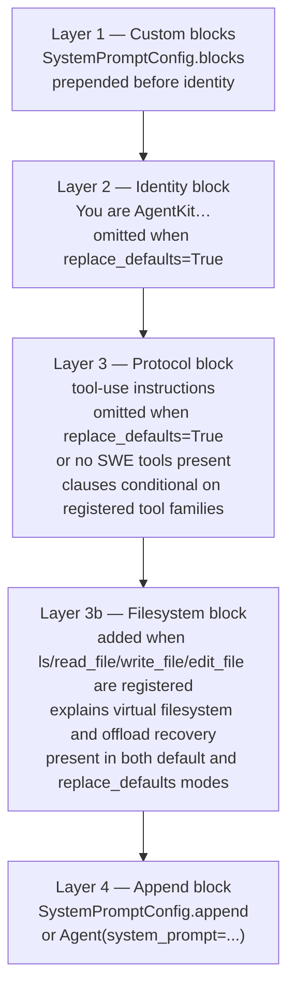

**Invariant:** when the full default toolset is registered and `replace_defaults=False`, the protocol block is byte-identical to the pinned reference in `tests/test_system_blocks.py`. Change the wording only intentionally and update the parity test.

---

## 10. Structured Output Paths

Two independent mechanisms surface the same field: `ResultEvent.structured_output: dict | None`.

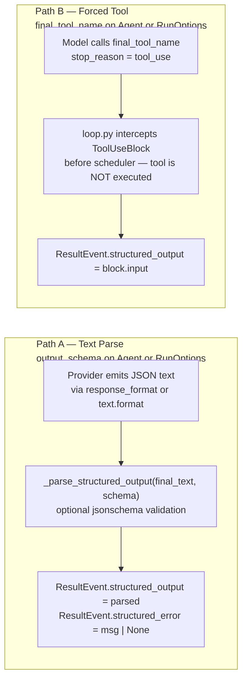

Path B is more reliable for complex schemas and works across all providers without `response_format` support.

---

## 11. Compaction

`maybe_compact(session, agent)` is called at the top of each turn:

1. Count tokens in `provider_view` via `agent.provider.context_window(agent.model)`.
2. If within threshold — no-op.
3. Otherwise submit a summarization request via `agent.provider.stream()` and replace old messages in `provider_view` with the summary, emitting `CompactionEvent`.

**Invariant:** `full_history` is never modified. Only `provider_view` shrinks. Compaction uses the configured `agent.provider` — never a hardcoded OpenAI call.

---

## 12. Skills and Subagents

**Skills** are loaded from `.agent_kit/skills/*/SKILL.md`. Each file has YAML frontmatter (`name`, `description`, `allowed_tools`, `model_override`) and a markdown body. When a skill is invoked, the body is injected as a `<system-reminder>` per-turn via `_re_inject_skill_context`. Gated by `FeatureFlags(skills=True)`.

**Subagents** are defined in `.agent_kit/agents.yaml`. `subagents/runner.py` creates a child agent with its own tool overlay and system prompt. The child's system blocks are computed from its own tool names — not copied from the parent. Gated by `FeatureFlags(subagents=True)`.

**MCP** — `connect_mcp_servers(configs)` wraps each MCP tool as a duck-typed AgentKit tool. Names are normalized via `mcp/naming.py`. The connection closes on `agent.close()`. Gated by `FeatureFlags(mcp=True)`.

---

## 13. Key Invariants

These must not break across refactors:

| # | Invariant |
|---|---|
| 1 | **`full_history` is append-only** — only `loop.py` appends; never write to it elsewhere. |
| 2 | **`provider_view` is the only thing compaction mutates** — `full_history` is untouched. |
| 3 | **Tool protocol is duck-typed** — no base class, no `isinstance`; check attribute presence. |
| 4 | **`stream()` yields normalized dicts** — the loop must not import any provider's raw types. |
| 5 | **Default SWE system-block text is pinned** — `test_system_blocks.py` has a byte-identical parity assertion; update it intentionally. |
| 6 | **`final_tool_name` tool is never scheduled** — the loop intercepts before the scheduler. |
| 7 | **Context builders do not mutate history** — they receive a `provider_view` snapshot and return ephemeral request context. |
| 8 | **`run_deps` is set once per `run_loop` call** — at the top, from `opts.deps ?? agent.deps`. |
| 9 | **Loop guard is on by default** — `Agent()` without `loop_guard=` gets `LoopGuard()` with safe thresholds; disable explicitly with `Agent(loop_guard=None)`. |
| 10 | **Provider capabilities apply per-request** — `_build_turn_request()` always calls `apply_provider_capabilities()` when the provider has `capabilities()`; no provider receives features it declared unsupported. |
| 11 | **Offload only replaces `ToolResult.content` before block construction** — the full result is preserved on `ToolCallEndEvent.tool_result`; `full_history` and `provider_view` receive the preview only. `maybe_offload` never raises — a backend write failure silently returns the original result so a storage hiccup never breaks a run. |
| 12 | **Filesystem tools are excluded from offloading** — `read_file`, `write_file`, `edit_file`, `ls` are in `OffloadConfig.skip_tools` by default; reading a large file back cannot trigger a recursive re-offload. |
