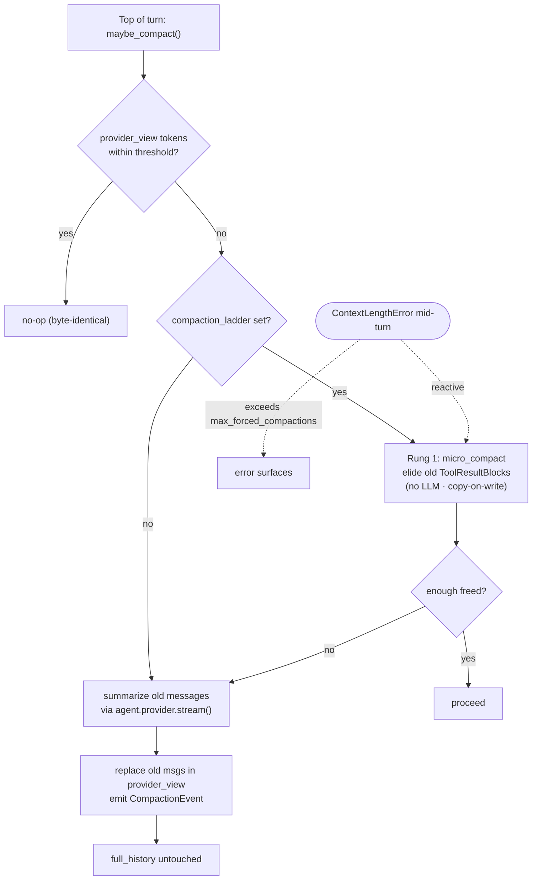

# Compaction

> Part of the [Linch architecture guide](./README.md).

`maybe_compact(session, agent)` is called at the top of each turn:

1. Count tokens in `provider_view` via `agent.provider.context_window(agent.model)`.
2. If within threshold — no-op.
3. Otherwise submit a summarization request via `agent.provider.stream()` and replace old messages in `provider_view` with the summary, emitting `CompactionEvent`.

**Invariant:** `full_history` is never modified. Only `provider_view` shrinks. Compaction uses the configured `agent.provider` — never a hardcoded OpenAI call.

`DefaultCompaction` remains the default. `DetailedCompaction` is opt-in via
`Agent(compaction=DetailedCompaction())` and uses a continuation-safe summary
with user intent, key information/artifacts touched, errors/fixes, pending tasks,
current work, and the next step. The section wording is domain-neutral (it asks
for identifiers — paths, URLs, IDs, names — rather than assuming files/code), so
it suits non-coding hosts too.

`DefaultCompaction`'s default prompt is coding-oriented (it asks for file paths,
tool calls, and the like); `DetailedCompaction`'s default is domain-neutral.
Since linch is *embeddable* and not every host is a coding agent, **both** accept
a `prompt=` override — `DefaultCompaction(prompt=...)` /
`DetailedCompaction(prompt=...)` — so a non-coding host can reword the summary
without reimplementing a `CompactionStrategy`. Omitting it keeps each strategy's
built-in prompt, so default behavior is unchanged. A ready-made domain-neutral prompt ships as
`GENERAL_SUMMARY_PROMPT` (public) for hosts that want a sensible non-coding
default without writing their own:
`Agent(compaction=DefaultCompaction(prompt=GENERAL_SUMMARY_PROMPT))`.

### Compaction ladder (opt-in)

`Agent(compaction_ladder=CompactionLadder())` adds recovery rungs around the
strategy; with the default `compaction_ladder=None` the behavior above is
byte-identical.

- **Rung 1 — micro-compact** (`micro_compact` in `compaction.py`): elide
  `ToolResultBlock` contents older than `keep_recent_turns` with a short
  placeholder. No LLM call; copy-on-write (blocks are shared with
  `full_history`, so changed messages are rebuilt, never mutated); every
  `tool_use_id` stays paired. Runs proactively inside `maybe_compact` (skips
  summarization when elision frees enough) and reactively, once per turn, when
  the provider raises `ContextLengthError`.
- **Rung 2 — forced compaction with a circuit breaker**: the reactive path
  (`_stream_turn_with_ladder` in `loop/streaming.py`) retries with forced compactions up
  to `max_forced_compactions` per run, then lets the error surface. The legacy
  path (no ladder) keeps its original single-retry-per-turn semantics in
  `_stream_turn_with_compaction_retry`.

## Design rationale

- **Only `provider_view` shrinks; `full_history` is sacred.** The model only ever
  sees `provider_view`, so that is the only thing worth compacting. `full_history`
  stays complete because it is the durable audit record and the source of truth a
  resumed run rebuilds from — summarizing it would be lossy and irreversible.
- **Summarize through `agent.provider`, never a hardcoded vendor call.** Compaction
  is just another model turn, so it must honor the same provider the run uses.
  Hardcoding OpenAI would break Anthropic/Gemini/local users and split the cost
  accounting.
- **Cheapest rung first.** `micro_compact` is LLM-free (elide stale tool results)
  and runs before paying for a summarization call; summarization only fires when
  elision can't free enough. This keeps the common case free and fast.
- **Copy-on-write, not mutation.** `provider_view` blocks are shared by reference
  with `full_history`, so elision rebuilds the changed messages instead of mutating
  them — otherwise shrinking the model's view would silently corrupt the durable
  record. `tool_use_id` pairing is preserved so no provider rejects an orphaned result.
- **Circuit breaker over open-ended retry.** Forced compaction is capped at
  `max_forced_compactions` per run so a pathologically large single turn surfaces a
  clear `ContextLengthError` instead of looping on summarization forever.

---

Back to the [architecture index](./README.md).
