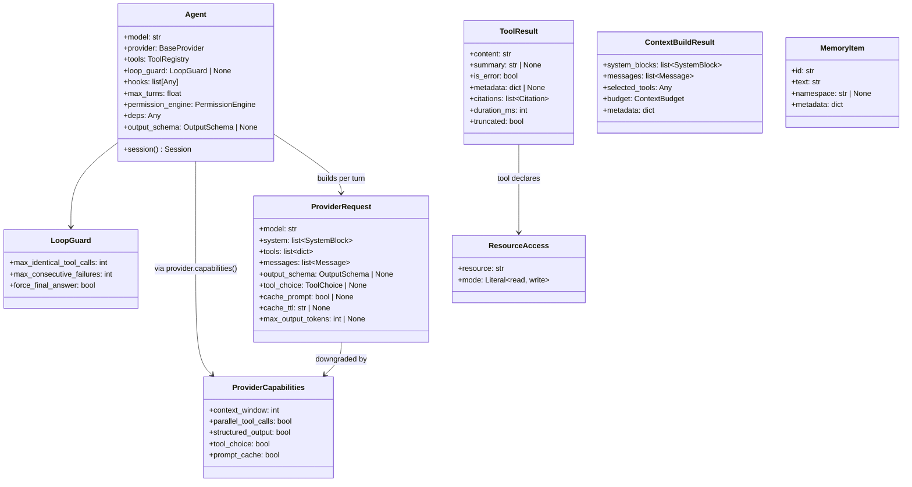

# Key Data Types

> Part of the [Linch architecture guide](./README.md).

## Design rationale

- **`Agent` is immutable config; `Session` is mutable state.** Splitting them lets one
  `Agent` mint many concurrent sessions safely, and makes the config the single thing a
  host reasons about when wiring an agent.
- **`ProviderRequest` is rebuilt per turn and downgraded against
  `ProviderCapabilities`.** The request is assembled fresh each turn so per-turn context
  and capability stripping (drop `cache_*` for non-caching providers, drop
  `output_schema` where unsupported) never leak into the next turn or another provider.
- **`ToolResult` separates the model channel from the host channel.** `content` is the
  compact text the model sees; `summary`/`metadata`/`citations`/`duration_ms` are for
  the host (UI, provenance, telemetry). One return type serves both without forcing the
  model to wade through rich metadata it doesn't need.
- **`ResourceAccess` is declarative, not lock-based.** A tool *declares* what it
  reads/writes; the scheduler derives safe parallelism from those declarations, so
  concurrency is a property of data, not hand-placed locks.

---

Back to the [architecture index](./README.md).
