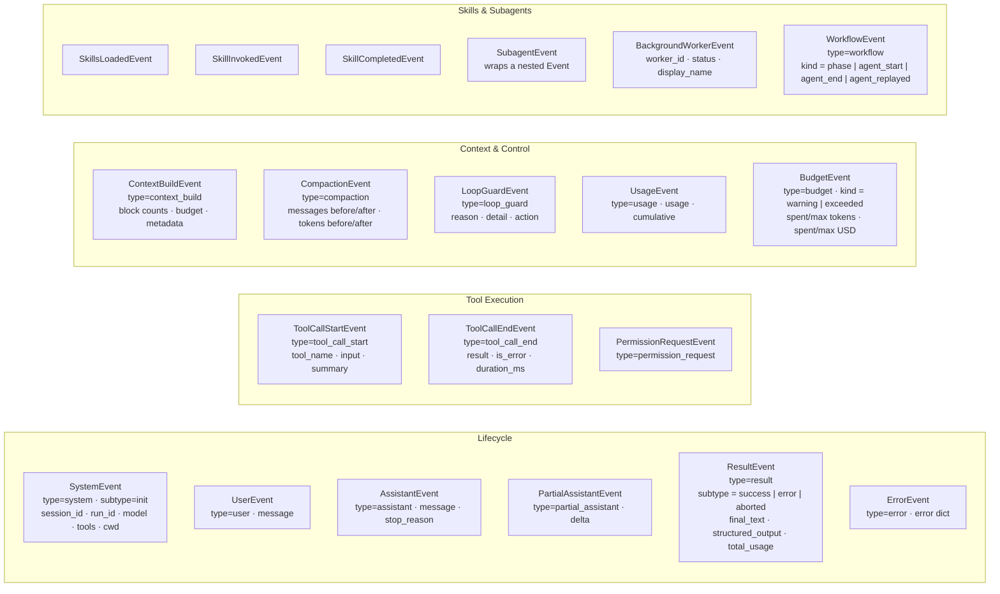

# Event Taxonomy

> Part of the [Linch architecture guide](./README.md).

All events are `@dataclass(slots=True)` with a `type: Literal[...]` discriminator. Every cross-cutting concern surfaces through events; callers never poll internal state.

`BackgroundWorkerEvent` is emitted when a background worker task completes (success or failure); it carries `worker_id`, `status`, and `display_name`.

`event_to_dict` and `event_from_dict` in `events.py` provide full round-trip serialization for all event types.

## Design rationale

- **Events are the *only* output channel.** Every cross-cutting concern (assistant
  text, tool calls, permissions, usage, compaction, budget, subagents) surfaces as an
  event; callers never poll internal state. This makes the loop observable and lets a
  UI render progress live without reaching into `Session`.
- **A `type` literal discriminator + `slots=True`.** The literal makes events
  cheap to switch on and safe to pattern-match; `slots` keeps them light since one run
  can emit thousands.
- **Full round-trip serialization (`event_to_dict`/`event_from_dict`).** Events are
  the persisted run log, so they must survive a process restart and reload — which is
  what makes durable resume and offline run reports possible.
- **Nesting via `SubagentEvent`, not a flattened stream.** A child's events are wrapped
  rather than merged inline, so a consumer can tell parent activity from worker activity
  and reconstruct the tree.

---

Back to the [architecture index](./README.md).
