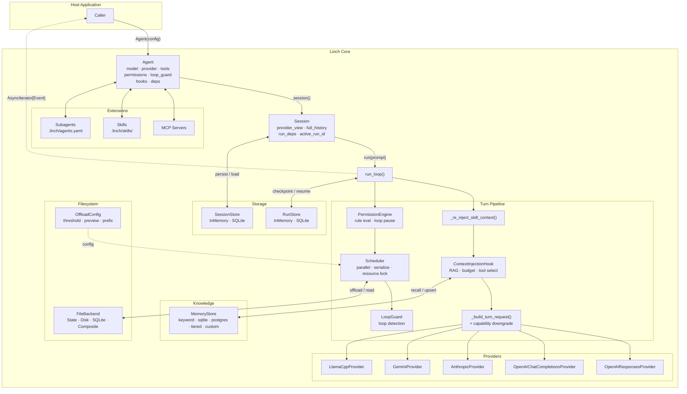

# System Overview

> Part of the [Linch architecture guide](./README.md).

The framework is a harness of pluggable subsystems composed around a single event-driven loop. The caller only interacts with `Agent` (config) and `Session` (state); everything else is internal machinery wired together inside `run_loop`.

## Design rationale

- **One loop, pluggable subsystems.** All orchestration lives in `run_loop`; every
  subsystem (provider, store, memory, filesystem, permissions) is a duck-typed
  protocol wired in by reference. There is exactly one place control flow happens, and
  each subsystem is swappable without touching the loop.
- **The caller's surface is just `Agent` + `Session`.** `Agent` is immutable config,
  `Session` is mutable state; everything else is internal. A small public surface keeps
  the SDK embeddable and lets internals change without breaking callers (the supported
  surface is exactly `linch.__all__`).
- **Async-first, no blocking I/O in the core.** The whole loop is `async`, so a host
  app can run many agents concurrently and stream events without threads.
- **No process-global mutable state.** Each `Agent` builds its own registry, sessions,
  permission engine, and extension state — so N agents run in one process (multi-tenant)
  with no cross-talk.
- **Provider-agnostic by contract.** The loop only knows the `BaseProvider` interface;
  per-provider quirks are isolated behind `capabilities()` + a request downgrade, so the
  same agent code runs on OpenAI, Anthropic, Gemini, or a local model.

---

Back to the [architecture index](./README.md).
