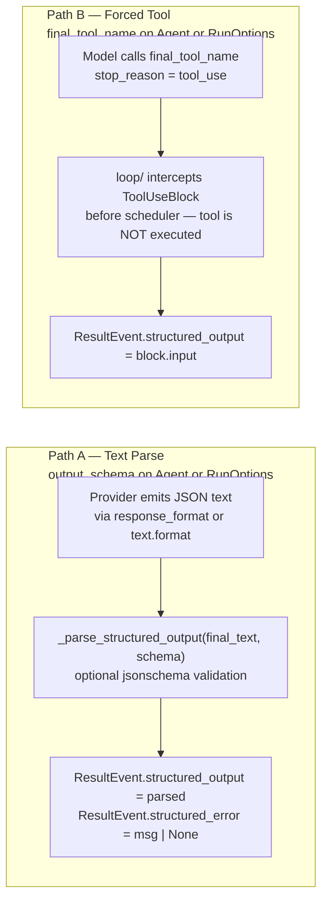

# Structured Output Paths

> Part of the [Linch architecture guide](./README.md).

Two independent mechanisms surface the same field: `ResultEvent.structured_output: dict | None`.

Path B is more reliable for complex schemas and works across all providers without `response_format` support.

## Design rationale

- **Two paths because providers disagree.** Some endpoints enforce a JSON schema
  natively (`response_format` / `text.format`), others don't. Path A uses native
  enforcement when available; Path B (force the model to call a named tool and read
  its `input`) works everywhere, including providers with no structured-output
  support — so the SDK never depends on a capability a given model lacks.
- **Both converge on one field.** Whichever path runs, the result lands in
  `ResultEvent.structured_output`, so callers write one extraction path regardless of
  provider — the mechanism is an implementation detail, not part of the contract.
- **The final tool is intercepted, never executed.** Path B recognizes
  `final_tool_name` before the scheduler runs, so the "tool" is a pure output channel
  with no side effect — it can't accidentally do work, and the loop terminates on it.
- **Repair is a retry, not a hard failure.** When Path A's text fails validation, the
  error is re-injected as a system-reminder and the loop runs another turn (up to
  `structured_output_retries`), because a malformed-JSON turn is usually recoverable
  by telling the model what was wrong — cheaper than failing the whole run.

---

Back to the [architecture index](./README.md).
