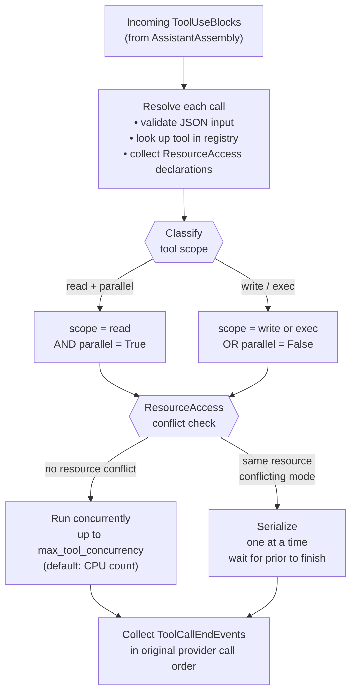
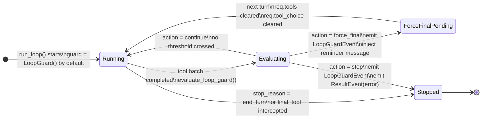
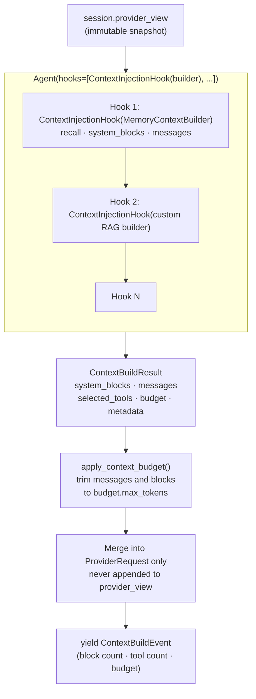
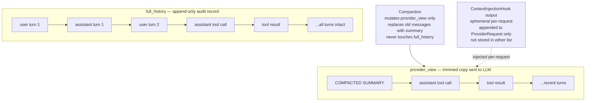
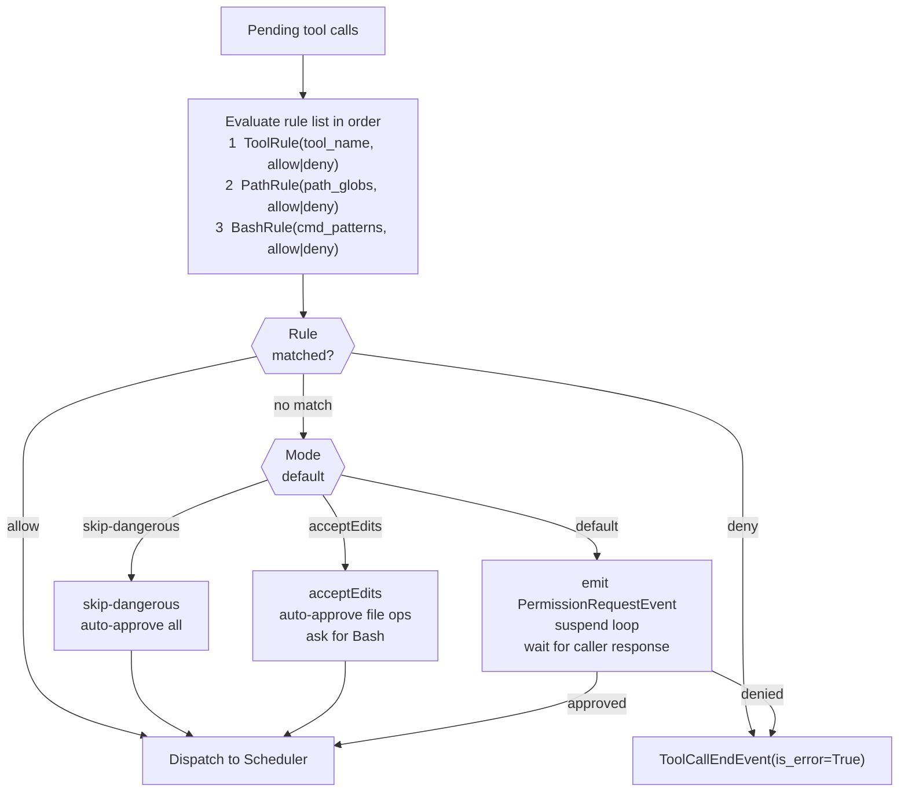
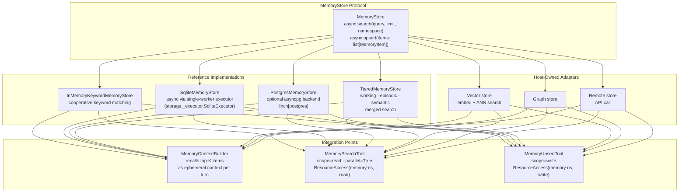
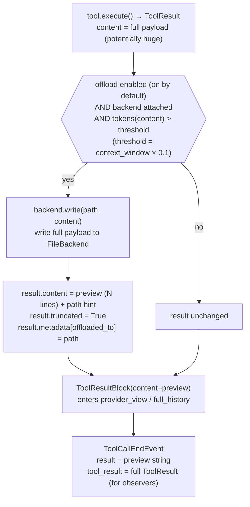

# Subsystems

> Part of the [Linch architecture guide](./README.md).

### 3.1 Scheduler — Parallel & Serialized Execution

The scheduler is the only place tool calls are executed. It enforces concurrency policies and resource conflict rules before dispatching.



**Rules:**
- `scope="read"` + `parallel=True` → may run concurrently up to `Agent(max_tool_concurrency=N)` or env `AGENTKIT_MAX_TOOL_CONCURRENCY`.
- `scope="write"` or `scope="exec"` → always serialize, regardless of `parallel` flag.
- `ResourceAccess(resource, mode)` enables finer conflict detection: two `"read"` accesses on the same resource overlap freely; any `"write"` on a resource being read or written by another call serializes.
- Result events are emitted in the **original provider tool-call order**, not completion order.
- **Timeouts** — `Agent(tool_timeout_ms=N)` (env `AGENTKIT_TOOL_TIMEOUT_MS`) sets an agent-wide execution deadline. Per-tool override: `execution_timeout_ms` class attribute (`0` = opt-out). Timeout → `is_error=True` result, run continues. Uses `asyncio.wait_for` (Python 3.10 safe). `ToolTimeoutError` (`retryable=True`) is the typed exception class.
- **Retry** — `Agent(tool_retry=RetryOptions(...))` enables opt-in exponential-backoff retry. Read-scope tools retry any exception; write/exec tools only retry when the tool sets `retryable = True`. `AbortError` is never retried.

---

### 3.2 Loop Guard — Agentic Loop Detection

Detects obvious runaway loops cheaply (no extra LLM call) and terminates cleanly.



**Trip conditions** — `evaluate_loop_guard` checks after every tool batch:

| Check | Threshold | Config field |
|---|---|---|
| Repeated identical call | `call_counts[name:sorted_json] >= N` | `max_identical_tool_calls` (default `3`) |
| Consecutive failure streak | all tools errored for N batches in a row | `max_consecutive_failures` (default `3`) |
| Max turns | `range(max_turns)` exhausted | `Agent(max_turns=N)` emits `LoopGuardEvent(reason="max_turns")` |

`force_final_answer=True` injects a `<system-reminder>` message and strips `req.tools = []` for one final turn so the model must answer in text.

---

### 3.3 Provider Capabilities — Request Downgrade

Every provider declares its feature support. `apply_provider_capabilities()` (called during `ProviderRequest` assembly in `loop/request.py`) applies downgrades so no provider receives flags it cannot handle.

```mermaid
flowchart LR
    OPTS["Agent / RunOptions\noutput_schema\ntool_choice\ncache_prompt = True\ncache_ttl"]

    REQ["ProviderRequest\n(initial build)"]

    CAPS["provider.capabilities(model)\nProviderCapabilities"]

    APPLY["apply_provider_capabilities(req, caps)"]

    C1{{"prompt_cache\n= False?"}}
    C2{{"tool_choice\n= False?"}}
    C3{{"structured_output\n= False?"}}

    D1["clear cache_prompt\nclear cache_ttl"]
    D2["clear tool_choice"]
    D3["clear output_schema\nloop text-parses response instead"]

    FINAL["ProviderRequest\n(provider-ready)"]

    OPTS --> REQ --> CAPS --> APPLY
    APPLY --> C1
    C1 -->|"yes"| D1 --> C2
    C1 -->|"no"| C2
    C2 -->|"yes"| D2 --> C3
    C2 -->|"no"| C3
    C3 -->|"yes"| D3 --> FINAL
    C3 -->|"no"| FINAL
```



**Declared capabilities per provider:**

| Provider | `prompt_cache` | `structured_output` | `tool_choice` |
|---|---|---|---|
| `OpenAIResponsesProvider` | ✓ | ✓ | ✓ |
| `OpenAIChatCompletionsProvider` | ✓ | ✓ | ✓ |
| `LlamaCppProvider` | ✓ | ✓ | ✓ |
| `VLLMProvider` | ✓ | ✓ | ✓ |
| `SGLangProvider` | ✓ | ✓ | ✓ |
| `AnthropicProvider` | ✓ | ✓ | ✓ |
| `GeminiProvider` | ✓ | ✓ | ✓ |

`structured_output=True` means the provider/loop pair can enforce or route
structured output without falling back to untyped free text. OpenAI Chat,
OpenAI Responses, llama.cpp, vLLM, SGLang, and Gemini map `output_schema` to
provider-native schema parameters. Anthropic maps `output_schema` to a generated
final schema tool; the loop treats that schema tool as terminal structured
output rather than dispatching it as a real tool.

**Choosing between the two OpenAI providers:**

| | `OpenAIChatCompletionsProvider` | `OpenAIResponsesProvider` |
|---|---|---|
| **API** | `POST /chat/completions` | `POST /responses` |
| **Compatible with** | Any OpenAI-compatible endpoint (DeepSeek, Azure, Groq, Together, …) | OpenAI only |
| **History** | Full message array resent every turn | Stateful — sends `previous_response_id`; only new messages travel the wire |
| **Reasoning/thinking** | `delta.reasoning_content` (DeepSeek-style extension) | Native `reasoning` object with `effort` + `summary` levels; encrypted reasoning tokens |
| **Structured output param** | `response_format: json_schema` | `text.format: json_schema` |
| **Use when** | Any OpenAI-compatible provider, or when `reasoning_content` round-trip is enough | OpenAI o1/o3/o4 and reasoning-native models where `effort` tuning matters |

Duck-typed test fakes that omit `capabilities()` are safely skipped via a `hasattr` guard — no test changes required when adding new providers.

`LlamaCppProvider` is a Chat Completions variant for llama.cpp server. It keeps
streaming enabled with `stream: true`, omits OpenAI's `stream_options` field,
maps structured output to llama.cpp's documented `response_format` shape, and
uses `/v1/props` or `/props` to cache the server's `n_ctx` context window when
that endpoint is available.

`VLLMProvider` and `SGLangProvider` are Chat Completions variants for
self-hosted OpenAI-compatible servers. They share the OpenAI-compatible stream
parser, expose deployment-specific request extensions through `extra_body`, and
leave model ids/context windows to runtime configuration.

`GeminiProvider` uses the optional `linch[gemini]` dependency and translates
Gemini content parts/function calls into the same normalized stream events used
by the rest of the loop.

---

### 3.4 Context Building Pipeline

`ContextInjectionHook` fires before every provider call, injecting ephemeral context without mutating conversation history.



**Rules:**
- Builder output is **ephemeral** — appended only to `ProviderRequest`, never to `session.provider_view` or `full_history`.
- `ContextBudget(max_tokens=N)` trims messages and system blocks before the request is sent.
- `selected_tools` narrows the provider schema list for this turn only; `session.agent.tools` is not mutated.
- Multiple `ContextInjectionHook`s can be registered; each receives the same unmodified view snapshot and their outputs are merged and re-budgeted as a whole.
- Builders must not block — use `await` for I/O.

---

### 3.5 Session History Model

Two separate lists track conversation history; only one is ever sent to the LLM.



**Invariant:** `full_history` is a strict superset of the logical conversation. Do not write to it outside the `loop/` package.

---

### 3.6 Permission Evaluation

Every tool call passes through the permission engine before reaching the scheduler.
For durable resume, allow/deny decisions made during a turn are snapshotted in
`RunCheckpoint.permission_decisions`. On resume of the same checkpointed turn,
the scheduler replays those decisions before invoking `canUseTool`; on the next
fresh turn, `session.current_turn_permission_decisions` is cleared so approvals
cannot leak across turns.



---

### 3.7 Memory and RAG Layer

Core ships a pluggable protocol with in-memory and durable reference implementations. Vector databases, embedding clients, and graph stores are host-owned and inject via the same protocol.



`TieredMemoryStore` is still a `MemoryStore`: it routes writes by
`MemoryItem.metadata["tier"]` (`working`, `episodic`, or `semantic`) and merges
search results across tiers with optional per-tier limits. Unknown or malformed
tier metadata falls back to `working`. `MemorySearchTool` preserves result ids,
tier counts, and citation tier metadata so run reports and eval scorers can
measure recall behavior in long-running sessions.

`RunReport.long_run` synthesizes long-horizon signals from the event stream and
checkpoint: context trimming and selected tools, memory searches/upserts,
recalled ids, tier counts, failed tool calls, recovery hints, completion, cost,
and resume phase. The eval package includes companion scorers for context
selection, context trimming, context metadata, memory recall, recovery after
tool failures, and successful completion.

Do not add vector database or embedding dependencies to core; adapters implement the protocol and live in examples.

---

### 3.8 Virtual Filesystem and Large-Result Offloading

Variable-length tool results (RAG, web search, large file reads) are the primary
cause of context-window blowup. The filesystem subsystem mirrors the Deep Agents
`FilesystemMiddleware` pattern: when a tool result exceeds a token threshold, the
scheduler writes the full payload to a `FileBackend` and substitutes a short
preview + path reference in `provider_view`. The model reads back only the slices
it needs via the `read_file` tool.



**Backends** — all implement the same `FileBackend` protocol:

| Backend | Storage | Lifecycle | Use when |
|---|---|---|---|
| `StateFileBackend` | In-memory dict | Per-session (default) | Zero-overhead ephemeral scratch |
| `DiskFileBackend` | Real files under a root dir | Until deleted | Want human-inspectable files; root defaults to `.linch/offload` (gitignored) |
| `SqliteFileBackend` | SQLite table | Persistent across sessions | Need cross-session recall (e.g. `/memories/`) |
| `CompositeFileBackend` | Routes by path prefix | Mixed | Ephemeral scratch + persistent `/memories/` subtree |

**`FileBackend` protocol** — five async methods:

```python
class FileBackend(Protocol):
    async def read(self, path, *, offset=0, limit=None) -> str: ...
    async def write(self, path, content) -> None: ...
    async def ls(self, prefix="") -> list[str]: ...
    async def edit(self, path, old, new, *, replace_all=False) -> int: ...
    async def exists(self, path) -> bool: ...
    async def delete(self, path) -> None: ...
```

**Four tools** are registered automatically when a backend is configured:

| Tool | Scope | Description |
|---|---|---|
| `ls` | read | List virtual files, optionally filtered by prefix |
| `read_file` | read | Read a file with optional offset/limit line window |
| `write_file` | write | Write or overwrite a scratchpad file |
| `edit_file` | write | Exact-string replace within a file |

**Invariant:** offloading mutates only `ToolResult.content` before the
`ToolResultBlock` is built. The full `ToolResult` still rides on
`ToolCallEndEvent.tool_result` for observers. `full_history` contains the preview,
not the raw payload — matching the session's context budget.

## Design rationale

- **The scheduler is the single execution chokepoint.** Every tool call runs through
  one place, so concurrency policy, resource conflicts, timeouts, retry, and offload
  are enforced structurally — no tool path can skip them. Read-scoped tools run in
  parallel; writes/exec serialize by default, with optional `ResourceAccess`
  declarations to allow safe parallelism without a global lock everywhere.
- **Permission decisions are keyed by a stable content key, not `tool_use_id`.** Tool
  IDs change across provider calls; keying durable HITL decisions by
  `(tool_name, input)` lets a resumed run replay a prior allow/deny instead of
  re-prompting. Only explicit allow/deny persist — abort/error denials don't, so a
  transient failure never hardens into a stored "no".
- **Offload mutates only the model's view.** The preview replaces `ToolResult.content`
  before the block enters `provider_view`, but the full payload still rides on the
  event for observers/RAG — large results stay within the context budget without being
  lost. A write failure silently returns the original result, so storage trouble never
  crashes a run.
- **Memory and filesystem are app-owned protocols.** Core ships keyword/SQLite
  backends but no vector DB or embedding dependency — anything heavier is an adapter
  the embedder supplies, keeping the core dependency-light and multi-tenant-safe.

---

Back to the [architecture index](./README.md).
