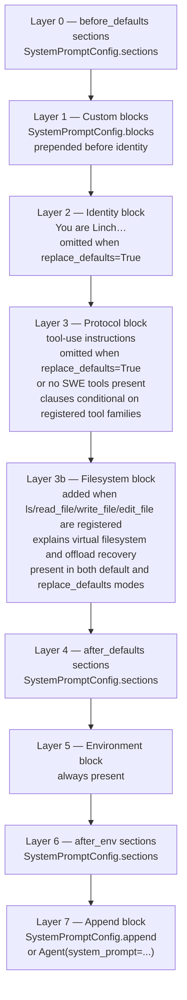

# System Prompt Layers

> Part of the [Linch architecture guide](./README.md).

`Agent._build_system_blocks(tool_names)` assembles the system prompt from
ordered layers. `SystemPromptConfig.sections` can insert named reusable
sections before defaults, after defaults, or after the environment block without
changing the built-in prompt text:

**Invariant:** when the full default toolset is registered and `replace_defaults=False`, the protocol block is byte-identical to the pinned reference in `tests/test_system_blocks.py`. Change the wording only intentionally and update the parity test.

## Design rationale

- **Layered insertion, not string surgery.** Callers add named sections
  before/after defaults or after the environment block — they never edit the built-in
  prompt text. This lets the SDK evolve the default prompt without breaking customizations,
  and keeps a host's additions in well-defined slots.
- **Prompt clauses are conditional on the registered toolset.** The protocol block only
  describes tool families that are actually present (and the filesystem block appears only
  when the fs tools are), so the model is never told how to use a tool it doesn't have —
  which also keeps a coordinator/restricted agent's prompt honest.
- **The default prompt is pinned by a parity test.** Byte-identical assertion against
  `tests/test_system_blocks.py` means prompt wording can't drift accidentally; a change is
  a deliberate edit-plus-update, because prompt text materially affects behavior.

---

Back to the [architecture index](./README.md).
