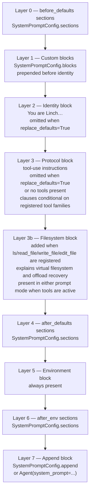

# System Prompt Layers

> Part of the [Linch architecture guide](./README.md).

`Agent._build_system_blocks(tool_names)` assembles the system prompt from
ordered layers. A bare Linch 2.0 `Agent` has a neutral identity and an empty
tool registry; it does not silently become a coding agent or trust the
workspace it happens to run in. Pass an explicit registry such as
`workspace_tools()` (or your own tools) to add capabilities. When a trusted
feature is enabled, its tools are added before the prompt is built.

`SystemPromptConfig.sections` can insert named reusable
sections before defaults, after defaults, or after the environment block without
changing the built-in prompt text:

```mermaid
flowchart TD
    L0["Layer 0 — before_defaults sections\nSystemPromptConfig.sections"]
    L1["Layer 1 — Custom blocks\nSystemPromptConfig.blocks\nprepended before identity"]
    L2["Layer 2 — Identity block\nYou are Linch…\nomitted when replace_defaults=True"]
    L3["Layer 3 — Protocol block\ntool-use instructions\nomitted when replace_defaults=True\nor no tools present\nclauses conditional on registered tool families"]
    LFS["Layer 3b — Filesystem block\nadded when ls/read_file/write_file/edit_file are registered\nexplains virtual filesystem and offload recovery\npresent in either prompt mode when tools are active"]
    L4["Layer 4 — after_defaults sections\nSystemPromptConfig.sections"]
    L5["Layer 5 — Environment block\nalways present"]
    L6["Layer 6 — after_env sections\nSystemPromptConfig.sections"]
    L7["Layer 7 — Append block\nSystemPromptConfig.append\nor Agent(system_prompt=...)"]

    L0 --> L1 --> L2 --> L3 --> LFS --> L4 --> L5 --> L6 --> L7
```

**Invariant:** when the explicit `workspace_tools()` preset is registered and
`replace_defaults=False`, the software-workspace protocol block is byte-identical
to the pinned reference in `tests/test_system_blocks.py`. A bare agent renders
the neutral identity and runtime metadata without workspace instructions.
Change wording only intentionally and update the parity test.

## Design rationale

- **Layered insertion, not string surgery.** Callers add named sections
  before/after defaults or after the environment block — they never edit the built-in
  prompt text. This lets the SDK evolve the default prompt without breaking customizations,
  and keeps a host's additions in well-defined slots.
- **Prompt clauses are conditional on the registered toolset.** The protocol block only
  describes tool families that are actually present (and the filesystem block appears only
  when the fs tools are), so the model is never told how to use a tool it doesn't have —
  which also keeps a coordinator/restricted agent's prompt honest.
- **Tools can own prompt contributions.** A tool may expose an optional
  `system_prompt_sections` iterable or zero-argument callable. The active
  registry validates these `SystemPromptSection` values, orders them by tool
  name and declaration order, and inserts them at their declared placement.
  Inactive tools cannot affect a request prompt; duplicate or malformed active
  sections fail before the provider call.
- **The default prompt is pinned by a parity test.** Byte-identical assertion against
  `tests/test_system_blocks.py` means prompt wording can't drift accidentally; a change is
  a deliberate edit-plus-update, because prompt text materially affects behavior.

---

Back to the [architecture index](./README.md).
