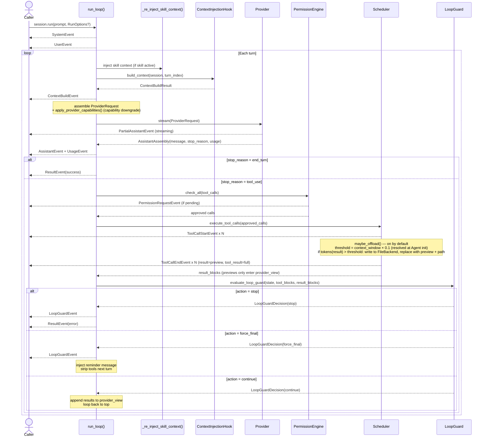

# Turn Lifecycle

> Part of the [Linch architecture guide](./README.md).

One complete agent turn — from receiving the prompt to deciding whether to continue looping.

## Design rationale

- **The model decides when to stop, not a step counter.** The loop continues while
  the response contains tool calls and stops on a text-only (`end_turn`) response.
  This lets a task take as many or as few turns as it needs; `max_turns` and the
  loop guard are safety bounds, not the primary control.
- **Permission gate sits *between* the model's request and execution.** Tool calls
  are checked before the scheduler runs them, so a denied call never produces a side
  effect — the gate can pause the loop for human input mid-turn.
- **Context-builder output is appended to the request, never written into
  `provider_view`.** Per-turn RAG/memory is ephemeral: it informs one provider call
  without polluting the durable conversation, which keeps `provider_view` stable and
  replayable across turns.
- **Everything is an event over an async generator.** The caller drives iteration, so
  a slow consumer naturally backpressures the producer, and a UI can render
  streaming/usage/permission events as they arrive instead of waiting for the turn to
  finish.
- **Loop-guard and offload run at fixed chokepoints.** Loop detection evaluates each
  tool batch (no extra LLM call), and `maybe_offload` is applied at the single result
  chokepoint — both are structural, so they can't be bypassed by a code path that
  forgets to call them.

---

Back to the [architecture index](./README.md).
