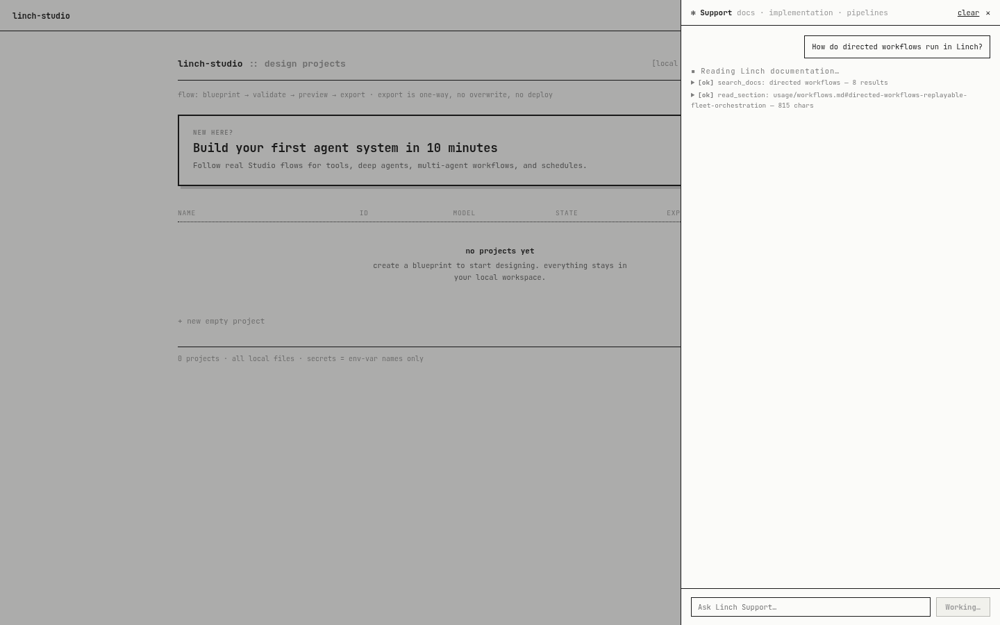

# Linch Studio

Linch Studio is a local-first visual blueprint editor and deterministic skeleton exporter for
[Linch](../README.md). It runs on `127.0.0.1`, stores projects as YAML plus a separate layout
file, and never runs or deploys generated workflows.

The manual editor is fully offline. With `LINCH_STUDIO_*` configuration, the optional Support
surface gives documentation-grounded answers and static implementation recipes. During a
provider-backed documentation or implementation turn, the drawer shows bounded retrieval activity
and a provisional answer preview, then replaces it with the validated response and evidence.
Provider thinking and raw structured JSON are never rendered. Pipeline creation is
confirmation-gated and can only create a reviewable candidate Blueprint; it cannot change project
state until the user explicitly accepts it.

## Live Support streaming

This recording shows the real drawer while it retrieves documentation and drafts a grounded answer.
The progress view is provisional: only the validated final Support response is kept in the
conversation.

[](artifacts/live-demo/support-streaming-live.webm)

[Watch the WebM recording](artifacts/live-demo/support-streaming-live.webm) if the preview does
not open video playback in your Markdown viewer.

## Development

```bash
pip install -e '../[dev,mcp,anthropic,gemini]'
pip install -e '.[dev]'
pytest
```

### Frontend

The browser UI is a React + TypeScript + Vite app in [`web/`](web/). `linch-studio serve`
serves whatever is in `src/linch_studio/static/`, which is Vite's build output — so build
once before serving, or use the dev server for a live-reloading loop.

```bash
cd web
npm install
npm run build     # typecheck + build into ../src/linch_studio/static/
npm test          # vitest unit tests
npm run e2e       # playwright smoke flows (spawns its own `linch-studio serve`)
```

```bash
npm run dev       # http://127.0.0.1:5173, proxies /api to a `serve` on port 8765
```

`npm run dev` expects `linch-studio serve --workspace ./designs` running in another shell.

API types in `web/src/api/schema.ts` are generated from the FastAPI OpenAPI document — never
hand-edit them:

```bash
npm run api:generate   # re-dump openapi.json and regenerate schema.ts
npm run api:check      # fails when either is out of date with the Python models (CI runs this)
```

## CLI

```bash
linch-studio serve --workspace ./designs
linch-studio tui --workspace ./designs
linch-studio new nightly-review --workspace ./designs --template routine
linch-studio migrate ./legacy.yaml --out ./legacy.v1alpha2.yaml
linch-studio validate ./designs/nightly-review/linch-studio.yaml
linch-studio preview ./designs/nightly-review/linch-studio.yaml
linch-studio export ./designs/nightly-review/linch-studio.yaml --out ../nightly-review
linch-studio schema --out studio.schema.json
```

Export is one-way and refuses to overwrite a non-empty directory or an existing ZIP. The
generated Python project becomes the source of truth; the copied blueprint and manifest are
provenance artifacts.

`linch-studio tui` is the offline terminal companion for listing and opening local designs,
validating drafts, inspecting generated files, exporting, and editing YAML in `$EDITOR`.
It covers the same local operations as the browser UI without leaving the terminal.

Architecture and local-operation details are in [docs/architecture.md](docs/architecture.md)
and [docs/usage.md](docs/usage.md). Current follow-up work and release gates are tracked in
[ROADMAP.md](ROADMAP.md).
